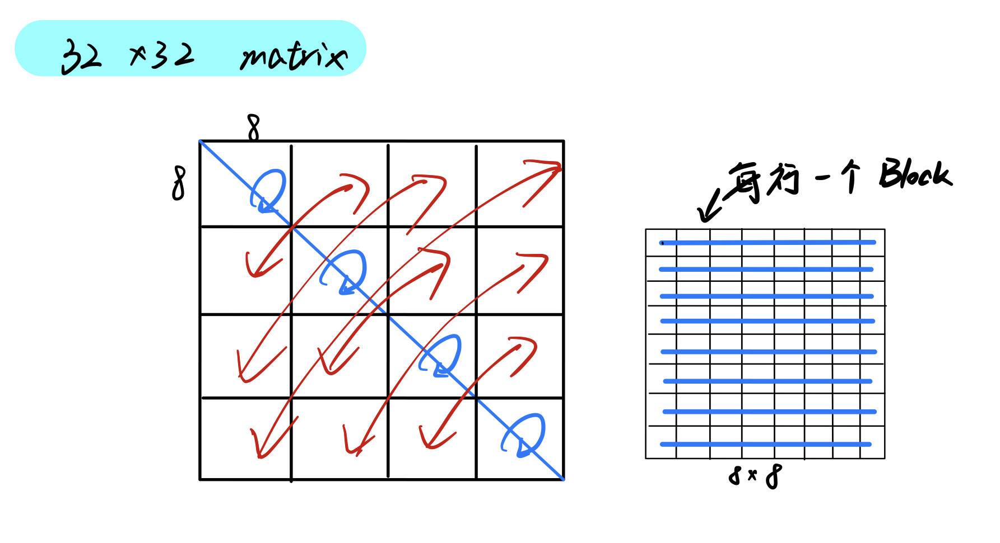

# 0x0

实验源：[http://csapp.cs.cmu.edu/3e/labs.html](http://csapp.cs.cmu.edu/3e/labs.html)

> 直接点击实验名视作以教师身份下载教学资源。题目文件应于Self-Study Handout下载

原书pdf：[https://github.com/Sorosliu1029/CSAPP-Labs/raw/master/Computer%20Systems%20A%20Programmers%20Perspective%20(3rd).pdf](https://github.com/Sorosliu1029/CSAPP-Labs/raw/master/Computer%20Systems%20A%20Programmers%20Perspective%20(3rd).pdf)

# Data Lab

下载解压题目文件：

```sh
wget http://csapp.cs.cmu.edu/3e/datalab-handout.tar
tar xvf datalab-handout.tar
```

题目说明：

[http://csapp.cs.cmu.edu/3e/README-datalab](http://csapp.cs.cmu.edu/3e/README-datalab)

我们的任务是在受限使用运算符与控制流的前提下，实现bit.c中的每个函数的功能。

## 实现异或运算

异或，即 “不同时为0” 且 “不同时为1”

`^`，即 `~(~x&~y)` 且 `~(x&y)`

```c
//1
/* 
 * bitXor - x^y using only ~ and & 
 *   Example: bitXor(4, 5) = 1
 *   Legal ops: ~ &
 *   Max ops: 14
 *   Rating: 1
 */
int bitXor(int x, int y) {
	return ~(~x&~y)&~(x&y);
}
```

## 求32位下最小的补码数值

补码，二补数，2's complement，参见：

[https://zh.wikipedia.org/zh-cn/%E4%BA%8C%E8%A3%9C%E6%95%B8](https://zh.wikipedia.org/zh-cn/%E4%BA%8C%E8%A3%9C%E6%95%B8)

32位下，最小的补码数值为`1000000000000000000000000000000`

补码`10000000`为什么可以表示-128？而非0、128？参见：

[https://www.zhihu.com/question/28685048](https://www.zhihu.com/question/28685048)

```c
/* 
 * tmin - return minimum two's complement integer 
 *   Legal ops: ! ~ & ^ | + << >>
 *   Max ops: 4
 *   Rating: 1
 */
int tmin(void) {
	return 1 << 31;
}
```

## 判断输入是否是补码中的最大整数

32位下，补码中的最大整数是`0x7fffffff`，接下来省略一些，只写8bits，下文同理。

核心手段是造出`00000000`，利用0与非0值返回true与false：

若 `x = 0111111`

`x + 1 + x = 11111111`

`~(x + 1 + x) = 00000000 = 0`

但同时需要排除 `x = 11111111` 的情况，因为此时 `x + 1 + x` 溢出后也得到 `11111111`

故借助：

`x = 11111111` 时 `x + !(x + 1) = 0`

`x = 01111111` 时 `x + !(x + 1) = 01111111 = !0`

来排除：

```c
/*
 * isTmax - returns 1 if x is the maximum, two's complement number,
 *     and 0 otherwise 
 *   Legal ops: ! ~ & ^ | +
 *   Max ops: 10
 *   Rating: 1
 */
int isTmax(int x) {
	return !(~(x + 1 + x)) & (x + !(x + 1));
}
```

## 判断所有奇数位是否都为1

位的编号从0（最低有效）到31（最高有效）

采用掩码，即当 `x | 0x55555555 == 0xffffffff` 时则返回1

`0x55 == 0b 0101 0101`

```c
/* 
 * allOddBits - return 1 if all odd-numbered bits in word set to 1
 *   where bits are numbered from 0 (least significant) to 31 (most significant)
 *   Examples allOddBits(0xFFFFFFFD) = 0, allOddBits(0xAAAAAAAA) = 1
 *   Legal ops: ! ~ & ^ | + << >>
 *   Max ops: 12
 *   Rating: 2
 */
int allOddBits(int x) {
	int a = (0x55 << 0) | (0x55 << 8) | (0x55 << 16) | (0x55 << 24);
	return !~(x | a);
}
```

## 求 -x

按位取反加一即得负数

补码实际上是一个`阿贝尔群`，对于 `x`，`-x` 是其补码，所以 `-x` 可以通过对 `x` 取反加1得到

```c
/* 
 * negate - return -x 
 *   Example: negate(1) = -1.
 *   Legal ops: ! ~ & ^ | + << >>
 *   Max ops: 5
 *   Rating: 2
 */
int negate(int x) {
	return ~x + 1;
}
```

## 判断是否为数字字符ASCII码

用减法，判断 `x-0x30 >= 0 && 0x39 - x >= 0`

但题干要求不能用减号，那么可以根据补码原理用加号实现减法

最后判断两个中间值的符号位全为0即可返回true

```c
/* 
 * isAsciiDigit - return 1 if 0x30 <= x <= 0x39 (ASCII codes for characters '0' to '9')
 *   Example: isAsciiDigit(0x35) = 1.
 *            isAsciiDigit(0x3a) = 0.
 *            isAsciiDigit(0x05) = 0.
 *   Legal ops: ! ~ & ^ | + << >>
 *   Max ops: 15
 *   Rating: 3
 */
int isAsciiDigit(int x) {
	int a = x + (~0x30 + 1); // x - 0x30
	int b = 0x39 + (~x + 1); // 0x39 - x
	return !(a >> 31 | b >> 31);
}
```

## 实现C语言 ? : 运算符

将x转化为 `00000000` 或 `11111111` 用于计算

```c
/* 
 * conditional - same as x ? y : z 
 *   Example: conditional(2,4,5) = 4
 *   Legal ops: ! ~ & ^ | + << >>
 *   Max ops: 16
 *   Rating: 3
 */
int conditional(int x, int y, int z) {
	x = !!x;
	x = ~x+1;
	return (x&y)|(~x&z);
}
```

## 实现 <= 运算符

> <<左移一律补0。>>右移可能补0也可能补符号位，视机器而定，通常是补符号位。

通过位运算实现比较两个数的大小，两种情况：一是符号不同正数为大，二是符号相同看差值符号

```c
/* 
 * isLessOrEqual - if x <= y  then return 1, else return 0 
 *   Example: isLessOrEqual(4,5) = 1.
 *   Legal ops: ! ~ & ^ | + << >>
 *   Max ops: 24
 *   Rating: 3
 */
int isLessOrEqual(int x, int y) {
	int v = y + (~x+1);
    int vSignBit = (v >> 31) & 1;
    int xSign = x & (1<<31);
    int ySign = y & (1<<31);
    int signXor = (xSign ^ ySing) >> 31 & 1;
    return ((!signXor) & (!vSignBit)) | ((signXor) & (xSign>>31));
}
```

## 实现逻辑非!

`00000000 ｜ (~00000000 + 1)` 得 0，其余数做此运算都得非0，且符号位为1

```c
/* 
 * logicalNeg - implement the ! operator, using all of 
 *              the legal operators except !
 *   Examples: logicalNeg(3) = 0, logicalNeg(0) = 1
 *   Legal ops: ~ & ^ | + << >>
 *   Max ops: 12
 *   Rating: 4 
 */
int logicalNeg(int x) {
	return ((x | (~x + 1)) >> 31) + 1
}
```

## 求一个数用补码表示所需的最少位数

正数则查找从左边第一个1开始，一直到最右边那一位的位数，再加上一个符号位

负数则查找从左边第一个0开始，一直到最右边那一位的位数，再加上一个符号位

```c
/* howManyBits - return the minimum number of bits required to represent x in
 *             two's complement
 *  Examples: howManyBits(12) = 5           0......0    01100
 *            howManyBits(298) = 10         0.0    0100101010
 *            howManyBits(-5) = 4           1.......1    1011
 *            howManyBits(0)  = 1           0..........0    0
 *            howManyBits(-1) = 1           1..........1    1
 *            howManyBits(0x80000000) = 32      10.........00
 *  Legal ops: ! ~ & ^ | + << >>
 *  Max ops: 90
 *  Rating: 4
 */
int howManyBits(int x) {
	int bit16, bit8, bit4, bit2, bit1;
    // 对操作数取反，将负数转为正数，正数不变，便于更好的计算
    int sign = x >> 31;
    x ^= sign;
	// 二分查找，先判断高16位有无存在1,并将范围缩小到高16位或低16位
	// 如果高16位存在1,则bit16 == 16,否则等于0
	bit16 = (!!(x >> 16)) << 4;
	x >>= bit16;
	// 查找剩余16位中的高8位是否存在1
	bit8 = (!!(x >> 8)) << 3;
	x >>= bit8;
	// 查找剩余8位中的高4位是否存在1
	bit4 = (!!(x >> 4)) << 2;
	x >>= bit4;
	// 查找剩余4位中的高2位是否存在1
	bit2 = (!!(x >> 2)) << 1;
	x >>= bit2;
	// 查找剩余2位中的高1位是否存在1
	bit1 = (!!(x >> 1)) << 0;
	x >>= bit1;
	// 最终加上一个符号位
	return bit16 + bit8 + bit4 + bit2 + bit1 + x + 1;
}
```

## 求浮点数与2相乘的值

目前浮点数通常遵循IEEE 754标准，参见：

[https://zh.wikipedia.org/wiki/IEEE_754](https://zh.wikipedia.org/wiki/IEEE_754)

32位下，我们使用IEEE 754单精度浮点数。


```c
/* 
 * floatScale2 - Return bit-level equivalent of expression 2*f for
 *   floating point argument f.
 *   Both the argument and result are passed as unsigned int's, but
 *   they are to be interpreted as the bit-level representation of
 *   single-precision floating point values.
 *   When argument is NaN, return argument
 *   Legal ops: Any integer/unsigned operations incl. ||, &&. also if, while
 *   Max ops: 30
 *   Rating: 4
 */
unsigned floatScale2(unsigned uf) {
	// 获取其exp部分的值
	int exp = (uf >> 23) & 0xff;
	int sign = uf & (1 << 31);
	// 如果传入的是非规格化的值
	if(exp == 0)
		return sign | uf << 1;
	// 如果传入的是无穷大或NaN
	else if(exp == 0xff)
		// 没法继续乘了，只能返回参数
		return uf;
	//乘2
	exp++;
	// 如果乘2后的结果超出范围（即溢出），则返回无穷大
	if(exp == 0xff)
		return sign | 0x7f800000; // expr全为0, frac全为1
	// 否则返回正常乘2后的值
	return sign | (exp << 23) | (uf & 0x7fffff);
}
```

## 浮点数转整数

```c
/* 
 * floatFloat2Int - Return bit-level equivalent of expression (int) f
 *   for floating point argument f.
 *   Argument is passed as unsigned int, but
 *   it is to be interpreted as the bit-level representation of a
 *   single-precision floating point value.
 *   Anything out of range (including NaN and infinity) should return
 *   0x80000000u.
 *   Legal ops: Any integer/unsigned operations incl. ||, &&. also if, while
 *   Max ops: 30
 *   Rating: 4
 */
int floatFloat2Int(unsigned uf) {
	int exp = (uf >> 23) & 0xff;
	int sign = (uf >> 31) & 1;
	int frac = uf & 0x7fffff;
	int shiftBits = 0;
	// 0比较特殊，先判断0(正负0都算作0)
	if(!(uf & 0x7fffffff))
		return 0;
	// 判断是否为NaN还是无穷大
	if(exp == 0xff)
		return 0x80000000u;
	// 指数减去偏移量，获取到真正的指数
	exp -= 127;
	// 需要注意的是，原来的frac一旦向左移位，其值就一定会小于1，所以返回0
	if(exp < 0)
		return 0;
	// 获取M，注意exp等于-127和不等于-127的情况是不一样的。当exp != -127时还有一个隐藏的1
	if(exp != -127)
		frac |= (1 << 23);
	// 要移位的位数。注意float的小数点是点在第23位与第22位之间
	shiftBits = 23 - exp;
	// 需要注意一点，如果指数过大，则也返回0x80000000u
	if(shiftBits < 31 - 23)
		return 0x80000000u;
	// 获取真正的结果
	frac >>= shiftBits;
	// 判断符号
	if(sign == 1)
		return ~frac + 1;
	else
		return frac;
}
```

## 求2.0的x次方

```c
/* 
 * floatPower2 - Return bit-level equivalent of the expression 2.0^x
 *   (2.0 raised to the power x) for any 32-bit integer x.
 *
 *   The unsigned value that is returned should have the identical bit
 *   representation as the single-precision floating-point number 2.0^x.
 *   If the result is too small to be represented as a denorm, return
 *   0. If too large, return +INF.
 * 
 *   Legal ops: Any integer/unsigned operations incl. ||, &&. Also if, while 
 *   Max ops: 30 
 *   Rating: 4
 */
unsigned floatPower2(int x) {
    // 得到偏移后的指数exp
	int exp = x + 127;
    // 如果exp大于等于255则为无穷大或越界
	if(exp > 0xfe)
		return 0x7f800000;
    // exp为0时，结果为0
	else if(exp < 0)
		return 0;
    //因为是求结果的浮点数比特级表示，所以偏移后的指数直接左移23bits即可
	return exp << 23;
}
```

# Bomb Lab

Bomb Lab，gdb拆弹实验。题干给定了一个炸弹程序，和它的部分源码。我们需要做的是通过动态调试，还原6个密码并正确输入，避免炸弹爆炸。否则下场就是：

```sh
▶ ./bomb
Welcome to my fiendish little bomb. You have 6 phases with
which to blow yourself up. Have a nice day!
Yaleyale! I don't give a shit!!!

BOOM!!!
The bomb has blown up.
```

好了，正儿八经来拆拆看，直接上钳子：`gdb bomb`

> 通过bomb.c可知，我们可以将找出的密码写入文件中供bomb读取，方便做题

## phase_1

炸弹1：

```sh
pwndbg> b phase_1
Breakpoint 1 at 0x400ee0
pwndbg> r
Starting program: /home/zkv/Gitrepos/A-B_Problem/csapp/BombLab/bomb
[Thread debugging using libthread_db enabled]
Using host libthread_db library "/lib/x86_64-linux-gnu/libthread_db.so.1".
Welcome to my fiendish little bomb. You have 6 phases with
which to blow yourself up. Have a nice day!
AAAAAAAA
```

直接在第一关下断点，随便输个字符串`AAAAAAAA`，接着向下走两步到校验的位置

```sh
   0x400ee0 <phase_1>       sub    rsp, 8
   0x400ee4 <phase_1+4>     mov    esi, 0x402400
 ► 0x400ee9 <phase_1+9>     call   strings_not_equal                      <strings_not_equal>
        rdi: 0x603780 (input_strings) ◂— 'AAAAAAAA'
        rsi: 0x402400 ◂— outsd  dx, dword ptr [rsi] /* 'Border relations with Canada have never been better.' */
        rdx: 0x1
        rcx: 0x8
```

可知第一关密码为：`Border relations with Canada have never been better.`

写入密码本：`echo "Border relations with Canada have never been better." >> passcodes`

## phase_2

用密码本直接来到第二关：`gdb --args bomb passcodes`

```sh
pwndbg> b phase_2
Breakpoint 1 at 0x400efc
pwndbg> r
Starting program: /home/zkv/Gitrepos/A-B_Problem/csapp/BombLab/bomb passcodes
[Thread debugging using libthread_db enabled]
Using host libthread_db library "/lib/x86_64-linux-gnu/libthread_db.so.1".
Welcome to my fiendish little bomb. You have 6 phases with
which to blow yourself up. Have a nice day!
Phase 1 defused. How about the next one?
AAAAAAAA
```

向下跟踪到第二关的校验逻辑中。首先是从我们输入的字符串中读取6个数字：

```sh
 ► 0x40148a <read_six_numbers+46>    call   __isoc99_sscanf@plt                      <__isoc99_sscanf@plt>
        s: 0x6037d0 (input_strings+80) ◂— 'AAAAAAAA'
        format: 0x4025c3 ◂— '%d %d %d %d %d %d'
        vararg: 0x7fffffffe070 —▸ 0x7fffffffe1c8 —▸ 0x7fffffffe4d5 ◂— '/home/zkv/Gitrepos/A-B_Problem/csapp/BombLab/bomb'
```

接着回到`phase_2`函数中进行校验：

```assembly
pwndbg> disassemble
Dump of assembler code for function phase_2:
   0x0000000000400efc <+0>:     push   rbp
   0x0000000000400efd <+1>:     push   rbx
   0x0000000000400efe <+2>:     sub    rsp,0x28
   0x0000000000400f02 <+6>:     mov    rsi,rsp
   0x0000000000400f05 <+9>:     call   0x40145c <read_six_numbers>
   0x0000000000400f0a <+14>:    cmp    DWORD PTR [rsp],0x1
   0x0000000000400f0e <+18>:    je     0x400f30 <phase_2+52>
   0x0000000000400f10 <+20>:    call   0x40143a <explode_bomb>
   0x0000000000400f15 <+25>:    jmp    0x400f30 <phase_2+52>
=> 0x0000000000400f17 <+27>:    mov    eax,DWORD PTR [rbx-0x4]
   0x0000000000400f1a <+30>:    add    eax,eax
   0x0000000000400f1c <+32>:    cmp    DWORD PTR [rbx],eax
   0x0000000000400f1e <+34>:    je     0x400f25 <phase_2+41>
   0x0000000000400f20 <+36>:    call   0x40143a <explode_bomb>
   0x0000000000400f25 <+41>:    add    rbx,0x4
   0x0000000000400f29 <+45>:    cmp    rbx,rbp
   0x0000000000400f2c <+48>:    jne    0x400f17 <phase_2+27>
   0x0000000000400f2e <+50>:    jmp    0x400f3c <phase_2+64>
   0x0000000000400f30 <+52>:    lea    rbx,[rsp+0x4]
   0x0000000000400f35 <+57>:    lea    rbp,[rsp+0x18]
   0x0000000000400f3a <+62>:    jmp    0x400f17 <phase_2+27>
   0x0000000000400f3c <+64>:    add    rsp,0x28
   0x0000000000400f40 <+68>:    pop    rbx
   0x0000000000400f41 <+69>:    pop    rbp
   0x0000000000400f42 <+70>:    ret
```

`<+27>`到`<+41>`之间为循环校验的逻辑。具体是比较`DWORD PTR [rbx]`是否等于`(DWORD PTR [rbx-0x4]) * 2`。而每一轮循环中`DWORD PTR [rbx]`存放的就是我们输入的数字。比如第一轮循环：

```sh
pwndbg> x $rbx-4
0x7fffffffe070: 0x00000001
```

那第二轮循环就应该：

```sh
pwndbg> x $rbx-4
0x7fffffffe070: 0x00000002
```

所以我们输入：`1 2 4 8 16 32`即可通关

`echo "1 2 4 8 16 32" >> passcodes`

## phase_3

用密码本直接来到第三关：`gdb -ex "b phase_3" -ex "r" --args bomb passcodes`

反汇编看看：

```assembly
pwndbg> disassemble phase_3
Dump of assembler code for function phase_3:
=> 0x0000000000400f43 <+0>:     sub    rsp,0x18
   0x0000000000400f47 <+4>:     lea    rcx,[rsp+0xc]
   0x0000000000400f4c <+9>:     lea    rdx,[rsp+0x8]
   0x0000000000400f51 <+14>:    mov    esi,0x4025cf
   0x0000000000400f56 <+19>:    mov    eax,0x0
   0x0000000000400f5b <+24>:    call   0x400bf0 <__isoc99_sscanf@plt>
   0x0000000000400f60 <+29>:    cmp    eax,0x1
   0x0000000000400f63 <+32>:    jg     0x400f6a <phase_3+39>
   0x0000000000400f65 <+34>:    call   0x40143a <explode_bomb>
   0x0000000000400f6a <+39>:    cmp    DWORD PTR [rsp+0x8],0x7
   0x0000000000400f6f <+44>:    ja     0x400fad <phase_3+106>
   0x0000000000400f71 <+46>:    mov    eax,DWORD PTR [rsp+0x8]
   0x0000000000400f75 <+50>:    jmp    QWORD PTR [rax*8+0x402470]
   0x0000000000400f7c <+57>:    mov    eax,0xcf
   0x0000000000400f81 <+62>:    jmp    0x400fbe <phase_3+123>
   0x0000000000400f83 <+64>:    mov    eax,0x2c3
   0x0000000000400f88 <+69>:    jmp    0x400fbe <phase_3+123>
   0x0000000000400f8a <+71>:    mov    eax,0x100
   0x0000000000400f8f <+76>:    jmp    0x400fbe <phase_3+123>
   0x0000000000400f91 <+78>:    mov    eax,0x185
   0x0000000000400f96 <+83>:    jmp    0x400fbe <phase_3+123>
   0x0000000000400f98 <+85>:    mov    eax,0xce
   0x0000000000400f9d <+90>:    jmp    0x400fbe <phase_3+123>
   0x0000000000400f9f <+92>:    mov    eax,0x2aa
   0x0000000000400fa4 <+97>:    jmp    0x400fbe <phase_3+123>
   0x0000000000400fa6 <+99>:    mov    eax,0x147
   0x0000000000400fab <+104>:   jmp    0x400fbe <phase_3+123>
   0x0000000000400fad <+106>:   call   0x40143a <explode_bomb>
   0x0000000000400fb2 <+111>:   mov    eax,0x0
   0x0000000000400fb7 <+116>:   jmp    0x400fbe <phase_3+123>
   0x0000000000400fb9 <+118>:   mov    eax,0x137
   0x0000000000400fbe <+123>:   cmp    eax,DWORD PTR [rsp+0xc]
   0x0000000000400fc2 <+127>:   je     0x400fc9 <phase_3+134>
   0x0000000000400fc4 <+129>:   call   0x40143a <explode_bomb>
   0x0000000000400fc9 <+134>:   add    rsp,0x18
   0x0000000000400fcd <+138>:   ret
```

阅读反汇编代码可知，此关需输入两个数字。第一个数字需小于7，第二个数字的值由输入的第一个数字推导得出（`switch case`结构）。第一个数字输入为`1`，来到：

```
   0x400f71 <phase_3+46>     mov    eax, dword ptr [rsp + 8]
   0x400f75 <phase_3+50>     jmp    qword ptr [rax*8 + 0x402470]
    ↓
 ► 0x400fb9 <phase_3+118>    mov    eax, 0x137
   0x400fbe <phase_3+123>    cmp    eax, dword ptr [rsp + 0xc]
   0x400fc2 <phase_3+127>    je     phase_3+134                      <phase_3+134>
```

得一个合法的解是：`1 311`

`echo "1 311" >> passcodes`

## phase_4

先来看看`phase_4`函数的反汇编：

```assembly
0x000000000040100c <+0>:     sub    rsp,0x18
0x0000000000401010 <+4>:     lea    rcx,[rsp+0xc]
0x0000000000401015 <+9>:     lea    rdx,[rsp+0x8]
0x000000000040101a <+14>:    mov    esi,0x4025cf
0x000000000040101f <+19>:    mov    eax,0x0
0x0000000000401024 <+24>:    call   0x400bf0 <__isoc99_sscanf@plt>
0x0000000000401029 <+29>:    cmp    eax,0x2
0x000000000040102c <+32>:    jne    0x401035 <phase_4+41>
0x000000000040102e <+34>:    cmp    DWORD PTR [rsp+0x8],0xe
0x0000000000401033 <+39>:    jbe    0x40103a <phase_4+46>
0x0000000000401035 <+41>:    call   0x40143a <explode_bomb>
0x000000000040103a <+46>:    mov    edx,0xe
0x000000000040103f <+51>:    mov    esi,0x0
0x0000000000401044 <+56>:    mov    edi,DWORD PTR [rsp+0x8]
0x0000000000401048 <+60>:    call   0x400fce <func4>
0x000000000040104d <+65>:    test   eax,eax
0x000000000040104f <+67>:    jne    0x401058 <phase_4+76>
0x0000000000401051 <+69>:    cmp    DWORD PTR [rsp+0xc],0x0
0x0000000000401056 <+74>:    je     0x40105d <phase_4+81>
0x0000000000401058 <+76>:    call   0x40143a <explode_bomb>
0x000000000040105d <+81>:    add    rsp,0x18
0x0000000000401061 <+85>:    ret
```

可知这一关也是让我们输入两个数字`a b`，且要满足如下条件：

- `(unsigned)a < 14`
- `b == 0`
- `func4(a, 0, 14) == 0`

`func4`反汇编如下：

```assembly
0x0000000000400fce <+0>:     sub    rsp,0x8
0x0000000000400fd2 <+4>:     mov    eax,edx
0x0000000000400fd4 <+6>:     sub    eax,esi
0x0000000000400fd6 <+8>:     mov    ecx,eax
0x0000000000400fd8 <+10>:    shr    ecx,0x1f
0x0000000000400fdb <+13>:    add    eax,ecx
0x0000000000400fdd <+15>:    sar    eax,1
0x0000000000400fdf <+17>:    lea    ecx,[rax+rsi*1]
0x0000000000400fe2 <+20>:    cmp    ecx,edi
0x0000000000400fe4 <+22>:    jle    0x400ff2 <func4+36>
0x0000000000400fe6 <+24>:    lea    edx,[rcx-0x1]
0x0000000000400fe9 <+27>:    call   0x400fce <func4>
0x0000000000400fee <+32>:    add    eax,eax
0x0000000000400ff0 <+34>:    jmp    0x401007 <func4+57>
0x0000000000400ff2 <+36>:    mov    eax,0x0
0x0000000000400ff7 <+41>:    cmp    ecx,edi
0x0000000000400ff9 <+43>:    jge    0x401007 <func4+57>
0x0000000000400ffb <+45>:    lea    esi,[rcx+0x1]
0x0000000000400ffe <+48>:    call   0x400fce <func4>
0x0000000000401003 <+53>:    lea    eax,[rax+rax*1+0x1]
0x0000000000401007 <+57>:    add    rsp,0x8
0x000000000040100b <+61>:    ret
```

`func4`是一个递归函数，IDA反编译得，仅供参考：

```c
__int64 __fastcall func4(__int64 a1, __int64 a2, int a3)
{
  int v3; // ecx
  __int64 result; // rax

  v3 = (a3 - (int)a2) / 2 + a2;
  if ( v3 > (int)a1 )
    return 2 * (unsigned int)func4(a1, a2);
  result = 0LL;
  if ( v3 < (int)a1 )
    return 2 * (unsigned int)func4(a1, (unsigned int)(v3 + 1)) + 1;
  return result;
}
```

将`func4`反汇编函数重写为可编译的形式后，编写汇编程序对此函数暴力枚举：

```assembly
global  _start

section .rodata
    s_msg: db "satisfy!!", 10
    d_msg: db "failed!!!", 10

section .text

func4:
    sub     rsp,0x8
    mov     eax,edx
    sub     eax,esi
    mov     ecx,eax
    shr     ecx,0x1f
    add     eax,ecx
    sar     eax,1
    lea     ecx,[rax+rsi*1]
    cmp     ecx,edi
    jle     p36
    lea     edx,[rcx-0x1]
    call    func4
    add     eax,eax
    jmp     p57
p36:
    mov     eax,0x0
    cmp     ecx,edi
    jge     p57
    lea     esi,[rcx+0x1]
    call    func4
    lea     eax,[rax+rax*1+0x1]
p57:
    add     rsp,0x8
    ret

_start:
    mov     r12, -1
loop:
    add     r12, 1
    cmp     r12, 10
    je      exit
    mov     rdi, r12
    mov     rsi, 0
    mov     rdx, 14
    call    func4
    test    eax, eax
    jne     dissatisfy
    mov     rsi, s_msg
    jmp     print
dissatisfy:
    mov     rsi, d_msg
print:
    mov     rax, 1
    mov     rdi, 1
    mov     rdx, 10
    syscall
    jmp     loop
exit:
    mov     rax, 60
    mov     rdi, 0
    syscall
```

汇编并运行：

```sh
nasm -f elf64 -o phase_4.o phase_4.S
ld -o phase_4 phase_4.o
./phase_4
```

由输出可得，0～9中满足条件的解为`0、1、3、7`

故此关的一个合法解为`7 0`

`echo "7 0" >> passcodes`

## phase_5

`phase_5`函数反汇编：

```assembly
0x0000000000401062 <+0>:     push   rbx
0x0000000000401063 <+1>:     sub    rsp,0x20
0x0000000000401067 <+5>:     mov    rbx,rdi
0x000000000040106a <+8>:     mov    rax,QWORD PTR fs:0x28
0x0000000000401073 <+17>:    mov    QWORD PTR [rsp+0x18],rax
0x0000000000401078 <+22>:    xor    eax,eax
0x000000000040107a <+24>:    call   0x40131b <string_length>
0x000000000040107f <+29>:    cmp    eax,0x6
0x0000000000401082 <+32>:    je     0x4010d2 <phase_5+112>
0x0000000000401084 <+34>:    call   0x40143a <explode_bomb>
0x0000000000401089 <+39>:    jmp    0x4010d2 <phase_5+112>
0x000000000040108b <+41>:    movzx  ecx,BYTE PTR [rbx+rax*1]
0x000000000040108f <+45>:    mov    BYTE PTR [rsp],cl
0x0000000000401092 <+48>:    mov    rdx,QWORD PTR [rsp]
0x0000000000401096 <+52>:    and    edx,0xf
0x0000000000401099 <+55>:    movzx  edx,BYTE PTR [rdx+0x4024b0]
0x00000000004010a0 <+62>:    mov    BYTE PTR [rsp+rax*1+0x10],dl
0x00000000004010a4 <+66>:    add    rax,0x1
0x00000000004010a8 <+70>:    cmp    rax,0x6
0x00000000004010ac <+74>:    jne    0x40108b <phase_5+41>
0x00000000004010ae <+76>:    mov    BYTE PTR [rsp+0x16],0x0
0x00000000004010b3 <+81>:    mov    esi,0x40245e
0x00000000004010b8 <+86>:    lea    rdi,[rsp+0x10]
0x00000000004010bd <+91>:    call   0x401338 <strings_not_equal>
0x00000000004010c2 <+96>:    test   eax,eax
0x00000000004010c4 <+98>:    je     0x4010d9 <phase_5+119>
0x00000000004010c6 <+100>:   call   0x40143a <explode_bomb>
0x00000000004010cb <+105>:   nop    DWORD PTR [rax+rax*1+0x0]
0x00000000004010d0 <+110>:   jmp    0x4010d9 <phase_5+119>
0x00000000004010d2 <+112>:   mov    eax,0x0
0x00000000004010d7 <+117>:   jmp    0x40108b <phase_5+41>
0x00000000004010d9 <+119>:   mov    rax,QWORD PTR [rsp+0x18]
0x00000000004010de <+124>:   xor    rax,QWORD PTR fs:0x28
0x00000000004010e7 <+133>:   je     0x4010ee <phase_5+140>
0x00000000004010e9 <+135>:   call   0x400b30 <__stack_chk_fail@plt>
0x00000000004010ee <+140>:   add    rsp,0x20
0x00000000004010f2 <+144>:   pop    rbx
0x00000000004010f3 <+145>:   ret
```

其中：

```sh
pwndbg> x/s 0x4024b0
0x4024b0 <array.3449>:  "maduiersnfotvbylSo you think you can stop the bomb with ctrl-c, do you?"
pwndbg> x/s 0x40245e
0x40245e:       "flyers"
```

可知校验逻辑如下：

- 判断输入的字符串长度是否为6
- 循环6次如下操作：
    - 以当前字符与`0xf`做`&`运算，`ch & 0xf`得到的结果为索引，从字符串常量`maduiersnfotvbyl`中取出对应字符
- 判断取出的6个字符是否为`flyers`

故可得一个解为：`ionefg`

`echo "ionefg" >> passcodes`

## phase_6

<details>

<summary>点击展开<code>phase_6</code>函数的完整反汇编</summary>

```assembly
0x00000000004010f4 <+0>:     push   r14
0x00000000004010f6 <+2>:     push   r13
0x00000000004010f8 <+4>:     push   r12
0x00000000004010fa <+6>:     push   rbp
0x00000000004010fb <+7>:     push   rbx
0x00000000004010fc <+8>:     sub    rsp,0x50
0x0000000000401100 <+12>:    mov    r13,rsp
0x0000000000401103 <+15>:    mov    rsi,rsp
0x0000000000401106 <+18>:    call   0x40145c <read_six_numbers>
0x000000000040110b <+23>:    mov    r14,rsp
0x000000000040110e <+26>:    mov    r12d,0x0
0x0000000000401114 <+32>:    mov    rbp,r13
0x0000000000401117 <+35>:    mov    eax,DWORD PTR [r13+0x0]
0x000000000040111b <+39>:    sub    eax,0x1
0x000000000040111e <+42>:    cmp    eax,0x5
0x0000000000401121 <+45>:    jbe    0x401128 <phase_6+52>
0x0000000000401123 <+47>:    call   0x40143a <explode_bomb>
0x0000000000401128 <+52>:    add    r12d,0x1
0x000000000040112c <+56>:    cmp    r12d,0x6
0x0000000000401130 <+60>:    je     0x401153 <phase_6+95>
0x0000000000401132 <+62>:    mov    ebx,r12d
0x0000000000401135 <+65>:    movsxd rax,ebx
0x0000000000401138 <+68>:    mov    eax,DWORD PTR [rsp+rax*4]
0x000000000040113b <+71>:    cmp    DWORD PTR [rbp+0x0],eax
0x000000000040113e <+74>:    jne    0x401145 <phase_6+81>
0x0000000000401140 <+76>:    call   0x40143a <explode_bomb>
0x0000000000401145 <+81>:    add    ebx,0x1
0x0000000000401148 <+84>:    cmp    ebx,0x5
0x000000000040114b <+87>:    jle    0x401135 <phase_6+65>
0x000000000040114d <+89>:    add    r13,0x4
0x0000000000401151 <+93>:    jmp    0x401114 <phase_6+32>
0x0000000000401153 <+95>:    lea    rsi,[rsp+0x18]
0x0000000000401158 <+100>:   mov    rax,r14
0x000000000040115b <+103>:   mov    ecx,0x7
0x0000000000401160 <+108>:   mov    edx,ecx
0x0000000000401162 <+110>:   sub    edx,DWORD PTR [rax]
0x0000000000401164 <+112>:   mov    DWORD PTR [rax],edx
0x0000000000401166 <+114>:   add    rax,0x4
0x000000000040116a <+118>:   cmp    rax,rsi
0x000000000040116d <+121>:   jne    0x401160 <phase_6+108>
0x000000000040116f <+123>:   mov    esi,0x0
0x0000000000401174 <+128>:   jmp    0x401197 <phase_6+163>
0x0000000000401176 <+130>:   mov    rdx,QWORD PTR [rdx+0x8]
0x000000000040117a <+134>:   add    eax,0x1
0x000000000040117d <+137>:   cmp    eax,ecx
0x000000000040117f <+139>:   jne    0x401176 <phase_6+130>
0x0000000000401181 <+141>:   jmp    0x401188 <phase_6+148>
0x0000000000401183 <+143>:   mov    edx,0x6032d0
0x0000000000401188 <+148>:   mov    QWORD PTR [rsp+rsi*2+0x20],rdx
0x000000000040118d <+153>:   add    rsi,0x4
0x0000000000401191 <+157>:   cmp    rsi,0x18
0x0000000000401195 <+161>:   je     0x4011ab <phase_6+183>
0x0000000000401197 <+163>:   mov    ecx,DWORD PTR [rsp+rsi*1]
0x000000000040119a <+166>:   cmp    ecx,0x1
0x000000000040119d <+169>:   jle    0x401183 <phase_6+143>
0x000000000040119f <+171>:   mov    eax,0x1
0x00000000004011a4 <+176>:   mov    edx,0x6032d0
0x00000000004011a9 <+181>:   jmp    0x401176 <phase_6+130>
0x00000000004011ab <+183>:   mov    rbx,QWORD PTR [rsp+0x20]
0x00000000004011b0 <+188>:   lea    rax,[rsp+0x28]
0x00000000004011b5 <+193>:   lea    rsi,[rsp+0x50]
0x00000000004011ba <+198>:   mov    rcx,rbx
0x00000000004011bd <+201>:   mov    rdx,QWORD PTR [rax]
0x00000000004011c0 <+204>:   mov    QWORD PTR [rcx+0x8],rdx
0x00000000004011c4 <+208>:   add    rax,0x8
0x00000000004011c8 <+212>:   cmp    rax,rsi
0x00000000004011cb <+215>:   je     0x4011d2 <phase_6+222>
0x00000000004011cd <+217>:   mov    rcx,rdx
0x00000000004011d0 <+220>:   jmp    0x4011bd <phase_6+201>
0x00000000004011d2 <+222>:   mov    QWORD PTR [rdx+0x8],0x0
0x00000000004011da <+230>:   mov    ebp,0x5
0x00000000004011df <+235>:   mov    rax,QWORD PTR [rbx+0x8]
0x00000000004011e3 <+239>:   mov    eax,DWORD PTR [rax]
0x00000000004011e5 <+241>:   cmp    DWORD PTR [rbx],eax
0x00000000004011e7 <+243>:   jge    0x4011ee <phase_6+250>
0x00000000004011e9 <+245>:   call   0x40143a <explode_bomb>
0x00000000004011ee <+250>:   mov    rbx,QWORD PTR [rbx+0x8]
0x00000000004011f2 <+254>:   sub    ebp,0x1
0x00000000004011f5 <+257>:   jne    0x4011df <phase_6+235>
0x00000000004011f7 <+259>:   add    rsp,0x50
0x00000000004011fb <+263>:   pop    rbx
0x00000000004011fc <+264>:   pop    rbp
0x00000000004011fd <+265>:   pop    r12
0x00000000004011ff <+267>:   pop    r13
0x0000000000401201 <+269>:   pop    r14
0x0000000000401203 <+271>:   ret
```

</details>

逻辑较长，我们分块分析

首先有`read_six_numbers`函数，读入6个数字：

```assembly
0x0000000000401106 <+18>:    call   0x40145c <read_six_numbers>
```

接着是一个二层循环结构：

```assembly
0x0000000000401114 <+32>:    mov    rbp,r13
0x0000000000401117 <+35>:    mov    eax,DWORD PTR [r13+0x0]
0x000000000040111b <+39>:    sub    eax,0x1
0x000000000040111e <+42>:    cmp    eax,0x5
0x0000000000401121 <+45>:    jbe    0x401128 <phase_6+52>
0x0000000000401123 <+47>:    call   0x40143a <explode_bomb>
0x0000000000401128 <+52>:    add    r12d,0x1
0x000000000040112c <+56>:    cmp    r12d,0x6
0x0000000000401130 <+60>:    je     0x401153 <phase_6+95>
0x0000000000401132 <+62>:    mov    ebx,r12d
0x0000000000401135 <+65>:    movsxd rax,ebx
0x0000000000401138 <+68>:    mov    eax,DWORD PTR [rsp+rax*4]
0x000000000040113b <+71>:    cmp    DWORD PTR [rbp+0x0],eax
0x000000000040113e <+74>:    jne    0x401145 <phase_6+81>
0x0000000000401140 <+76>:    call   0x40143a <explode_bomb>
0x0000000000401145 <+81>:    add    ebx,0x1
0x0000000000401148 <+84>:    cmp    ebx,0x5
0x000000000040114b <+87>:    jle    0x401135 <phase_6+65>
0x000000000040114d <+89>:    add    r13,0x4
0x0000000000401151 <+93>:    jmp    0x401114 <phase_6+32>
```

对应的功能为检测：

- 输入的数字大小在[1,6]中
- 6个数字无重复

接下来是一个一层循环结构：

```assembly
0x0000000000401153 <+95>:    lea    rsi,[rsp+0x18]
0x0000000000401158 <+100>:   mov    rax,r14
0x000000000040115b <+103>:   mov    ecx,0x7
0x0000000000401160 <+108>:   mov    edx,ecx
0x0000000000401162 <+110>:   sub    edx,DWORD PTR [rax]
0x0000000000401164 <+112>:   mov    DWORD PTR [rax],edx
0x0000000000401166 <+114>:   add    rax,0x4
0x000000000040116a <+118>:   cmp    rax,rsi
0x000000000040116d <+121>:   jne    0x401160 <phase_6+108>
```

用于实现：`input_numbers[i] = 7 - input_numbers[i]`

接下来又是一个循环结构：

```assembly
0x000000000040116f <+123>:   mov    esi,0x0
0x0000000000401174 <+128>:   jmp    0x401197 <phase_6+163>
0x0000000000401176 <+130>:   mov    rdx,QWORD PTR [rdx+0x8]
0x000000000040117a <+134>:   add    eax,0x1
0x000000000040117d <+137>:   cmp    eax,ecx
0x000000000040117f <+139>:   jne    0x401176 <phase_6+130>
0x0000000000401181 <+141>:   jmp    0x401188 <phase_6+148>
0x0000000000401183 <+143>:   mov    edx,0x6032d0
0x0000000000401188 <+148>:   mov    QWORD PTR [rsp+rsi*2+0x20],rdx
0x000000000040118d <+153>:   add    rsi,0x4
0x0000000000401191 <+157>:   cmp    rsi,0x18
0x0000000000401195 <+161>:   je     0x4011ab <phase_6+183>
0x0000000000401197 <+163>:   mov    ecx,DWORD PTR [rsp+rsi*1]
0x000000000040119a <+166>:   cmp    ecx,0x1
0x000000000040119d <+169>:   jle    0x401183 <phase_6+143>
0x000000000040119f <+171>:   mov    eax,0x1
0x00000000004011a4 <+176>:   mov    edx,0x6032d0
0x00000000004011a9 <+181>:   jmp    0x401176 <phase_6+130>
```

`0x6032d0`处保存的为`node`链表，数据域和指针域类型分别为`int`和`int*`：

```sh
pwndbg> x/12 0x6032d0
0x6032d0 <node1>:       0x000000010000014c      0x00000000006032e0
0x6032e0 <node2>:       0x00000002000000a8      0x00000000006032f0
0x6032f0 <node3>:       0x000000030000039c      0x0000000000603300
0x603300 <node4>:       0x00000004000002b3      0x0000000000603310
0x603310 <node5>:       0x00000005000001dd      0x0000000000603320
0x603320 <node6>:       0x00000006000001bb      0x0000000000000000
```

这部分是将经过上一步计算的6个数作为索引，分别取出对应node的所在地址，并存放于栈上

接着又是一个循环：

```assembly
0x00000000004011ab <+183>:   mov    rbx,QWORD PTR [rsp+0x20]
0x00000000004011b0 <+188>:   lea    rax,[rsp+0x28]
0x00000000004011b5 <+193>:   lea    rsi,[rsp+0x50]
0x00000000004011ba <+198>:   mov    rcx,rbx
0x00000000004011bd <+201>:   mov    rdx,QWORD PTR [rax]
0x00000000004011c0 <+204>:   mov    QWORD PTR [rcx+0x8],rdx
0x00000000004011c4 <+208>:   add    rax,0x8
0x00000000004011c8 <+212>:   cmp    rax,rsi
0x00000000004011cb <+215>:   je     0x4011d2 <phase_6+222>
0x00000000004011cd <+217>:   mov    rcx,rdx
0x00000000004011d0 <+220>:   jmp    0x4011bd <phase_6+201>
```

用于将`0x6032d0`处的`node`链表顺序修改为和上一步得到的栈数组相同的顺序

然后就是最终的校验了：

```assembly
0x00000000004011d2 <+222>:   mov    QWORD PTR [rdx+0x8],0x0
0x00000000004011da <+230>:   mov    ebp,0x5
0x00000000004011df <+235>:   mov    rax,QWORD PTR [rbx+0x8]
0x00000000004011e3 <+239>:   mov    eax,DWORD PTR [rax]
0x00000000004011e5 <+241>:   cmp    DWORD PTR [rbx],eax
0x00000000004011e7 <+243>:   jge    0x4011ee <phase_6+250>
0x00000000004011e9 <+245>:   call   0x40143a <explode_bomb>
0x00000000004011ee <+250>:   mov    rbx,QWORD PTR [rbx+0x8]
0x00000000004011f2 <+254>:   sub    ebp,0x1
0x00000000004011f5 <+257>:   jne    0x4011df <phase_6+235>
```

判断由上一步得到的链表中的数据是否为逐级递减的

原始链表数据大小关系为：`node3 > node4 > node5 > node6 > node1 > node2`

故我们需要输入：`4 3 2 1 6 5`

`echo "4 3 2 1 6 5" >> passcodes`

## secret_phase

我们成功解除了炸弹？观测到`bomb.c`的末尾有：

```c
    ......
	phase_6(input);
    phase_defused();

    /* Wow, they got it!  But isn't something... missing?  Perhaps
     * something they overlooked?  Mua ha ha ha ha! */

    return 0;
}
```

看起来不妙，我们在此打断点调试跟进试试：` gdb -ex "b bomb.c:109" -ex "r" --args bomb passcodes`

跟进`phase_defused`函数，观测到：

```sh
   0x4015f0 <phase_defused+44>    mov    esi, 0x402619
   0x4015f5 <phase_defused+49>    mov    edi, input_strings+240        <0x603870>
 ► 0x4015fa <phase_defused+54>    call   __isoc99_sscanf@plt                      <__isoc99_sscanf@plt>
        s: 0x603870 (input_strings+240) ◂— 0x302037 /* '7 0' */
        format: 0x402619 ◂— '%d %d %s'
        vararg: 0x7fffffffe038 ◂— 0x600000005

   0x4015ff <phase_defused+59>    cmp    eax, 3
   0x401602 <phase_defused+62>    jne    phase_defused+113                      <phase_defused+113>

   0x401604 <phase_defused+64>    mov    esi, 0x402622
   0x401609 <phase_defused+69>    lea    rdi, [rsp + 0x10]
   0x40160e <phase_defused+74>    call   strings_not_equal                      <strings_not_equal>
```

其中：

```sh
pwndbg> x/s 0x402619
0x402619:       "%d %d %s"
pwndbg> x/s 0x603870
0x603870 <input_strings+240>:   "7 0"
```

看来这在读取第四关的两个数字时，还试图在后面读取一个字符串。阅读反汇编后发现，是用于在下方`strings_not_equal`函数中与`0x402622`处的字符串进行比较：

```sh
pwndbg> x/s 0x402622
0x402622:       "DrEvil"
```

所以我们在第四关的输入后追加字符串`DrEvil`，即可进入隐藏关卡：`gdb -ex "b secret_phase" -ex "r" --args bomb passcodes`

`secret_phase`函数反汇编如下：

```assembly
0x0000000000401242 <+0>:     push   rbx
0x0000000000401243 <+1>:     call   0x40149e <read_line>
0x0000000000401248 <+6>:     mov    edx,0xa
0x000000000040124d <+11>:    mov    esi,0x0
0x0000000000401252 <+16>:    mov    rdi,rax
0x0000000000401255 <+19>:    call   0x400bd0 <strtol@plt>
0x000000000040125a <+24>:    mov    rbx,rax
0x000000000040125d <+27>:    lea    eax,[rax-0x1]
0x0000000000401260 <+30>:    cmp    eax,0x3e8
0x0000000000401265 <+35>:    jbe    0x40126c <secret_phase+42>
0x0000000000401267 <+37>:    call   0x40143a <explode_bomb>
0x000000000040126c <+42>:    mov    esi,ebx
0x000000000040126e <+44>:    mov    edi,0x6030f0
0x0000000000401273 <+49>:    call   0x401204 <fun7>
0x0000000000401278 <+54>:    cmp    eax,0x2
0x000000000040127b <+57>:    je     0x401282 <secret_phase+64>
0x000000000040127d <+59>:    call   0x40143a <explode_bomb>
0x0000000000401282 <+64>:    mov    edi,0x402438
0x0000000000401287 <+69>:    call   0x400b10 <puts@plt>
0x000000000040128c <+74>:    call   0x4015c4 <phase_defused>
0x0000000000401291 <+79>:    pop    rbx
0x0000000000401292 <+80>:    ret
```

其流程为：

- 读取一个用户输入的数字
- 判断输入数字是否满足：`input_number - 1 <= 1000`
- 判断是否满足：`fun7(&n1, input_number) == 2`

`fun7`反汇编如下：

```assembly
0x0000000000401204 <+0>:     sub    rsp,0x8
0x0000000000401208 <+4>:     test   rdi,rdi
0x000000000040120b <+7>:     je     0x401238 <fun7+52>
0x000000000040120d <+9>:     mov    edx,DWORD PTR [rdi]
0x000000000040120f <+11>:    cmp    edx,esi
0x0000000000401211 <+13>:    jle    0x401220 <fun7+28>
0x0000000000401213 <+15>:    mov    rdi,QWORD PTR [rdi+0x8]
0x0000000000401217 <+19>:    call   0x401204 <fun7>
0x000000000040121c <+24>:    add    eax,eax
0x000000000040121e <+26>:    jmp    0x40123d <fun7+57>
0x0000000000401220 <+28>:    mov    eax,0x0
0x0000000000401225 <+33>:    cmp    edx,esi
0x0000000000401227 <+35>:    je     0x40123d <fun7+57>
0x0000000000401229 <+37>:    mov    rdi,QWORD PTR [rdi+0x10]
0x000000000040122d <+41>:    call   0x401204 <fun7>
0x0000000000401232 <+46>:    lea    eax,[rax+rax*1+0x1]
0x0000000000401236 <+50>:    jmp    0x40123d <fun7+57>
0x0000000000401238 <+52>:    mov    eax,0xffffffff
0x000000000040123d <+57>:    add    rsp,0x8
0x0000000000401241 <+61>:    ret
```

`n1`为一个树结点：

```sh
pwndbg> x/60 &n1
0x6030f0 <n1>:  		0x0000000000000024      0x0000000000603110
0x603100 <n1+16>:       0x0000000000603130      0x0000000000000000
0x603110 <n21>: 		0x0000000000000008      0x0000000000603190
0x603120 <n21+16>:      0x0000000000603150      0x0000000000000000
0x603130 <n22>: 		0x0000000000000032      0x0000000000603170
0x603140 <n22+16>:      0x00000000006031b0      0x0000000000000000
0x603150 <n32>: 		0x0000000000000016      0x0000000000603270
0x603160 <n32+16>:      0x0000000000603230      0x0000000000000000
0x603170 <n33>: 		0x000000000000002d      0x00000000006031d0
0x603180 <n33+16>:      0x0000000000603290      0x0000000000000000
0x603190 <n31>: 		0x0000000000000006      0x00000000006031f0
0x6031a0 <n31+16>:      0x0000000000603250      0x0000000000000000
0x6031b0 <n34>: 		0x000000000000006b      0x0000000000603210
0x6031c0 <n34+16>:      0x00000000006032b0      0x0000000000000000
0x6031d0 <n45>: 		0x0000000000000028      0x0000000000000000
0x6031e0 <n45+16>:      0x0000000000000000      0x0000000000000000
0x6031f0 <n41>: 		0x0000000000000001      0x0000000000000000
0x603200 <n41+16>:      0x0000000000000000      0x0000000000000000
0x603210 <n47>: 		0x0000000000000063      0x0000000000000000
0x603220 <n47+16>:      0x0000000000000000      0x0000000000000000
0x603230 <n44>: 		0x0000000000000023      0x0000000000000000
0x603240 <n44+16>:      0x0000000000000000      0x0000000000000000
0x603250 <n42>: 		0x0000000000000007      0x0000000000000000
0x603260 <n42+16>:      0x0000000000000000      0x0000000000000000
0x603270 <n43>: 		0x0000000000000014      0x0000000000000000
0x603280 <n43+16>:      0x0000000000000000      0x0000000000000000
0x603290 <n46>: 		0x000000000000002f      0x0000000000000000
0x6032a0 <n46+16>:      0x0000000000000000      0x0000000000000000
0x6032b0 <n48>: 		0x00000000000003e9      0x0000000000000000
0x6032c0 <n48+16>:      0x0000000000000000      0x0000000000000000
```

`fun7`翻译为C语言代码如下：

```c
int fun7(TreeNode* node, int num)
{
  if(node == NULL)
    return -1;
  else
  {
    if(node->val <= num)
    {
      if(node->Val == num)
        return 0;
      else
        return 2 * fun7(node->right, num) + 1;
    }
    else
      return 2 * fun7(node->left, num);
  }
}
```

明显只有从`return 2 * fun7(node->left, num);`才能返回2这个数字

由此逆推可得，最终解为`22`

`echo "22" >> passcodes`

完整答案：

```sh
▶ cat passcodes
Border relations with Canada have never been better.
1 2 4 8 16 32
1 311
7 0 DrEvil
ionefg
4 3 2 1 6 5
22
```

```sh
▶ ./bomb passcodes
Welcome to my fiendish little bomb. You have 6 phases with
which to blow yourself up. Have a nice day!
Phase 1 defused. How about the next one?
That's number 2.  Keep going!
Halfway there!
So you got that one.  Try this one.
Good work!  On to the next...
Curses, you've found the secret phase!
But finding it and solving it are quite different...
Wow! You've defused the secret stage!
Congratulations! You've defused the bomb!
```

# Attack Lab

> Attack Lab是CSAPP2e中的Buffer Lab的更新，所以可以忽略后者

## Code Injection

- `ctarget`用于缓冲区溢出攻击
- `rtarget`用于ROP攻击
- `hex2raw`用于将16禁止转字符串
- `farm.c`
- `cookie.txt`

`ctarget`和`rtarget`需要参数`-q`取消链接服务器，参数`-i`用于输入文件：

```sh
▶ ./ctarget -h
Usage: [-hq] ./ctarget -i <infile>
  -h          Print help information
  -q          Don't submit result to server
  -i <infile> Input file
```

在我的本地环境运行时会直接segmentation fault，经查原因为：

```sh
*RSP  0x5561d668 ◂— 0
 ► 0x7ffff7df7150 <__vfprintf_internal+160>    movaps xmmword ptr [rsp + 0x10], xmm1
```

中，`xmmword ptr [rsp + 0x10]`不满足`movaps`指令要求的16字节对齐

### 0x1

### 0x2

### 0x3

## ROP

### 0x4

### 0x5

# Architecture Lab

# Cache Lab

README：[http://csapp.cs.cmu.edu/3e/README-cachelab](http://csapp.cs.cmu.edu/3e/README-cachelab)

参考：[Cache Lab Implementation and Blocking](http://www.cs.cmu.edu/afs/cs/academic/class/15213-f15/www/recitations/rec07.pdf)

## Part A. Building a cache simulator

在`csim.c`中编码，实现`csim-ref`相同的功能。

实现代码：`csim.c`：

```c
#include "cachelab.h"
#include <stdlib.h>
#include <getopt.h>
#include <unistd.h>
#include <stdio.h>
#include <string.h>
#include <limits.h>

// global parameters
int s, E, b, S;
char filename[1000];
// emulation status counts
int hit_count, miss_count, eviction_count;

typedef struct {
    int valid_bit;
    int tag;
    int lru_stamp;  // LRU时间戳
    char* block;    // 数据块，对于题目来说实际上并不需要，此处仅为了模拟真实cache
}cache_line, *cache_asso, **cache;

cache _cache_ = NULL;   // cache的(二级索引形式的)二维数组

// 打印 helper 内容的函数，-h 命令使用
void printUsage() {
    printf("Usage: ./csim-ref [-hv] -s <num> -E <num> -b <num> -t <file>\n"
            "Options:\n"
            "  -h         Print this help message.\n"
            "  -v         Optional verbose flag.\n"
            "  -s <num>   Number of set index bits.\n"
            "  -E <num>   Number of lines per set.\n"
            "  -b <num>   Number of block offset bits.\n"
            "  -t <file>  Trace file.\n\n"
            "Examples:\n"
            "  linux>  ./csim -s 4 -E 1 -b 4 -t traces/yi.trace\n"
            "  linux>  ./csim -v -s 8 -E 2 -b 4 -t traces/yi.trace\n");
}

// 初始化cache
void initCache() {
    _cache_ = (cache)malloc(sizeof(cache_asso) * S);
    for(int i = 0; i < S; ++i) {
        _cache_[i] = (cache_asso)malloc(sizeof(cache_line) * E);
        for(int j = 0; j < E; ++j) {
            _cache_[i][j].valid_bit = 0;
            _cache_[i][j].tag       = -1;
            _cache_[i][j].lru_stamp = -1;
            _cache_[i][j].block     = NULL;
        }
    }
}

void update(unsigned int address) {
    int max_stamp = INT_MIN;
    int max_stamp_index = -1;

    // 由内存地址求组索引与目标tag值
    int set_index = (address >> b) & ((-1U) >> (64 - s));
    int tag_value = address >> (b + s);

    // 在当前组中搜索
    for(int i = 0; i < E; ++i) {
        // tag相同，cache hit
        if(_cache_[set_index][i].tag == tag_value) {
            _cache_[set_index][i].lru_stamp = 0;
            hit_count++;
            return;
        }
    }

    // 当前组在hit后，处理其中空行
    for(int i = 0; i < E; ++i) {
        if(_cache_[set_index][i].valid_bit == 0) {
            _cache_[set_index][i].valid_bit = 1;
            _cache_[set_index][i].lru_stamp = 0;
            _cache_[set_index][i].tag       = tag_value;
            miss_count++;
            return;
        }
    }

    // 既没有hit，也没有空行，则触发替换
    eviction_count++;
    miss_count++;
    for(int i = 0; i < E; ++i) {
        // LRU擂台
        if(_cache_[set_index][i].lru_stamp > max_stamp) {
            max_stamp = _cache_[set_index][i].lru_stamp;
            max_stamp_index = i;
        }
    }

    // 挑选出LRU后的最坏的cache_line提供给tag_value对应的内存
    _cache_[set_index][max_stamp_index].tag = tag_value;
    _cache_[set_index][max_stamp_index].lru_stamp = 0;
    return;
}

// 每一轮全体时间戳都要+1
void updateStamp() {
    for(int i = 0; i < S; ++i)
        for(int j = 0; j < E; ++j)
            if(_cache_[i][j].valid_bit == 1)
                ++_cache_[i][j].lru_stamp;
}

void parseTrace() {
    FILE* fp = fopen(filename, "r");
    if(fp == NULL) {
        printf("open error");
        exit(-1);
    }

    // 解析输入内容
    char operator;          // I:忽略 L:load M:modify S:store
    unsigned int address;   // 内存地址
    int size;               // 数据大小

    while( fscanf(fp, " %c %xu,%d\n", &operator, &address, &size) > 0 ) {
        switch (operator) {
            case 'I':
                continue;
            case 'L':       // load访问一次
                update(address);
                break;
            case 'M':       // modify若miss，则还需store一次
                update(address);
            case 'S':       // store访问一次
                update(address);
        }
        updateStamp();      // 每轮更新时间戳
    }

    // 关文件，free内存
    fclose(fp);
    for(int i = 0; i < S; ++i)
        free(_cache_[i]);
    free(_cache_);
}

int main(int argc, char *argv[])
{
    hit_count = miss_count = eviction_count = 0;

    int opt;
    while( -1 != (opt = (getopt(argc, argv, "hvs:E:b:t:"))) ) {
        switch (opt) {
            case 'h':
                printUsage();
                return 0;
            case 'v':
                break;
            case 's':
                s = atoi(optarg);
                break;
            case 'E':
                E = atoi(optarg);
                break;
            case 'b':
                b = atoi(optarg);
                break;
            case 't':
                strcpy(filename, optarg);
                break;
            default:
                printUsage();
                return 0;
        }
    }

    S = 1 << s;

    initCache();    // 初始化cache
    parseTrace();   // 更新最终的三个参数
    printSummary(hit_count, miss_count, eviction_count);

    return 0;
}
```

编译：

```sh
gcc csim.c cachelab.c -o csim
```

结果：

```sh
▶ ./test-csim
                        Your simulator     Reference simulator
Points (s,E,b)    Hits  Misses  Evicts    Hits  Misses  Evicts
     3 (1,1,1)       9       8       6       9       8       6  traces/yi2.trace
     3 (4,2,4)       4       5       2       4       5       2  traces/yi.trace
     3 (2,1,4)       2       3       1       2       3       1  traces/dave.trace
     3 (2,1,3)     167      71      67     167      71      67  traces/trans.trace
     3 (2,2,3)     201      37      29     201      37      29  traces/trans.trace
     3 (2,4,3)     212      26      10     212      26      10  traces/trans.trace
     3 (5,1,5)     231       7       0     231       7       0  traces/trans.trace
     6 (5,1,5)  265189   21775   21743  265189   21775   21743  traces/long.trace
    27

TEST_CSIM_RESULTS=27
```

## Part B. Optimizing matrix transpose

Part B则是编写cache友好型程序，核心在于利用好程序的局部性，划分内存区域的访问顺序，尽量连续访问被cache缓存的数据。具体任务是实现矩阵转置。

对应的，我们需要计算给定的cache大小，以其为单位，分批次将同样大小的内存数据放入cache并完整处理完毕，以提高cache效率。ZiYang-Xie大佬的图很形象，蓝色箭头原地转置，红色箭头分块交换。

`trans.c:transpose_submit`具体实现如下：

```c
void transpose_submit(int M, int N, int A[N][M], int B[M][N])
{
    // S = 5, E = 1, B = 5

    if(M == 32 && N == 32) {
        // 该cache最多可读入32x32矩阵中的8行数据，故以每块8x8的大小分割并转置存放到另一个矩阵中
        for(int i = 0; i < N; i += 8)
            for(int j = 0; j < M; j += 8) {
                // 8x8块内转置
                for(int k = i; k < i + 8; ++k) {
                    int tmp1 = A[k][j];
                    int tmp2 = A[k][j+1];
                    int tmp3 = A[k][j+2];
                    int tmp4 = A[k][j+3];
                    int tmp5 = A[k][j+4];
                    int tmp6 = A[k][j+5];
                    int tmp7 = A[k][j+6];
                    int tmp8 = A[k][j+7];
                    B[j][k] = tmp1;
                    B[j+1][k] = tmp2;
                    B[j+2][k] = tmp3;
                    B[j+3][k] = tmp4;
                    B[j+4][k] = tmp5;
                    B[j+5][k] = tmp6;
                    B[j+6][k] = tmp7;
                    B[j+7][k] = tmp8;
                }
            }
    }

    else if (M == 64 && N == 64) {
        // 该cache最多可读入64x64矩阵中的4行数据，故以每块4x4的大小分割并转置存放到另一个矩阵中
        for (int i = 0; i < N; i += 4)
            for (int j = 0; j < M; j += 4) {
                for(int k = i; k < i + 4; k += 2) {
                    int tmp1 = A[k][j];
                    int tmp2 = A[k][j+1];
                    int tmp3 = A[k][j+2];
                    int tmp4 = A[k][j+3];
                    int tmp5 = A[k+1][j];
                    int tmp6 = A[k+1][j+1];
                    int tmp7 = A[k+1][j+2];
                    int tmp8 = A[k+1][j+3];
                    B[j][k] = tmp1;
                    B[j+1][k] = tmp2;
                    B[j+2][k] = tmp3;
                    B[j+3][k] = tmp4;
                    B[j][k+1] = tmp5;
                    B[j+1][k+1] = tmp6;
                    B[j+2][k+1] = tmp7;
                    B[j+3][k+1] = tmp8;
                }
            }
    }

    else if (M == 61 && N == 67) {
        // 对于61x67的矩阵，16x16可以满足miss数小于2k的要求，而17x17是最优选择，miss数为1950
        for (int i = 0; i < N; i += 17) {
            for (int j = 0; j < M; j += 17) {
                for(int k = i; k < i + 17 && k < N; k ++)
                    for(int l = j; l < j + 17 && l < M; l++)
                        B[l][k] = A[k][l];
            }
        }

    }

    return;
}
```

测试结果：

```sh
▶ ./driver.py
Part A: Testing cache simulator
Running ./test-csim
                        Your simulator     Reference simulator
Points (s,E,b)    Hits  Misses  Evicts    Hits  Misses  Evicts
     3 (1,1,1)       9       8       6       9       8       6  traces/yi2.trace
     3 (4,2,4)       4       5       2       4       5       2  traces/yi.trace
     3 (2,1,4)       2       3       1       2       3       1  traces/dave.trace
     3 (2,1,3)     167      71      67     167      71      67  traces/trans.trace
     3 (2,2,3)     201      37      29     201      37      29  traces/trans.trace
     3 (2,4,3)     212      26      10     212      26      10  traces/trans.trace
     3 (5,1,5)     231       7       0     231       7       0  traces/trans.trace
     6 (5,1,5)  265189   21775   21743  265189   21775   21743  traces/long.trace
    27


Part B: Testing transpose function
Running ./test-trans -M 32 -N 32
Running ./test-trans -M 64 -N 64
Running ./test-trans -M 61 -N 67

Cache Lab summary:
                        Points   Max pts      Misses
Csim correctness          27.0        27
Trans perf 32x32           8.0         8         288
Trans perf 64x64           3.8         8        1668
Trans perf 61x67          10.0        10        1951
          Total points    48.8        53
```

# Shell Lab

在本shell里，我们需要完善`tsh.c`，来实现一个行为与tshref相同的shell。

```c
/*
 * eval - Evaluate the command line that the user has just typed in
 *
 * If the user has requested a built-in command (quit, jobs, bg or fg)
 * then execute it immediately. Otherwise, fork a child process and
 * run the job in the context of the child. If the job is running in
 * the foreground, wait for it to terminate and then return.  Note:
 * each child process must have a unique process group ID so that our
 * background children don't receive SIGINT (SIGTSTP) from the kernel
 * when we type ctrl-c (ctrl-z) at the keyboard.
*/
void eval(char *cmdline)
{
    char *argv[MAXARGS];
    int state = UNDEF;
    sigset_t set;
    pid_t pid;

    if(parseline(cmdline, argv) == 1)
        state = BG;
    else
        state = FG;

    if(argv[0] == NULL)
        return;

    if(!builtin_cmd(argv)) {
        if(sigemptyset(&set) < 0)
            unix_error("sigemptyset error");
        if(sigaddset(&set, SIGINT) < 0 || sigaddset(&set, SIGTSTP) || sigaddset(&set, SIGCHLD))
            unix_error("sigaddset error");
        if(sigprocmask(SIG_BLOCK, &set, NULL) < 0)
            unix_error("sigprocmask error");

        if((pid == fork()) < 0)
            unix_error("fork error");
        else if(pid == 0) {
            if(sigprocmask(SIG_UNBLOCK, &set, NULL) < 0)
                unix_error("sigprocmask error");
            if(setpgid(0, 0) < 0)
                unix_error("setpgid error");
            if(execve(argv[0], argv, environ) < 0) {
                printf("%s: command not found\n", argv[0]);
                exit(0);
            }
        } else {
            addjob(jobs, pid, state, cmdline);
            if(sigprocmask(SIG_UNBLOCK, &set, NULL) < 0)
                unix_error("sigprocmask error");
            if(state == FG)
                waitfg(pid);
            else
                printf("[%d] (%d) %s", pid2jid(pid), pid, cmdline);
        }
    }

    return;
}
```

```c
/*
 * builtin_cmd - If the user has typed a built-in command then execute
 *    it immediately.
 */
int builtin_cmd(char **argv)
{
    if(!strcmp(argv[0], "quit"))
        exit(0);
    else if(!strcmp(argv[0], "bg") || !strcmp(argv[0], "fg"))
        do_bgfg(argv);
    else if(!strcmp(argv[0], "jobs"))
        listjobs(jobs);
    else
        return 0;     /* not a builtin command */
    return 1;
}
```

```c
/*
 * do_bgfg - Execute the builtin bg and fg commands
 */
void do_bgfg(char **argv)
{
    int parsed;
    struct job_t *job;

    if(!argv[1]){
        printf("%s command requires PID or %%jobid argument\n", argv[0]);
        return ;
    }

    if(argv[1][0] == '%'){
        if((parsed = strtol(&argv[1][1], NULL, 10)) <= 0){
            printf("%s: argument must be a PID or %%jobid\n",argv[0]);
            return;
        }
        if((job = getjobjid(jobs, parsed)) == NULL){
            printf("%%%d: No such job\n", parsed);
            return;
        }
    } else {
        if((parsed = strtol(argv[1], NULL, 10)) <= 0){
            printf("%s: argument must be a PID or %%jobid\n",argv[0]);
            return;
        }
        if((job = getjobpid(jobs, parsed)) == NULL){
            printf("(%d): No such process\n", parsed);
            return;
        }
    }

    if(!strcmp(argv[0], "bg")){
        job->state = BG;

        if(kill(-job->pid, SIGCONT) < 0)
            unix_error("kill error");
        printf("[%d] (%d) %s", job->jid, job->pid, job->cmdline);
    } else if(!strcmp(argv[0], "fg")) {
        job->state = FG;
        if(kill(-job->pid, SIGCONT) < 0)
            unix_error("kill error");
        waitfg(job->pid);
    } else {
        puts("do_bgfg: Internal error");
        exit(0);
    }
    return;
}
```

```c
/*
 * waitfg - Block until process pid is no longer the foreground process
 */
void waitfg(pid_t pid)
{
    sigset_t mask_temp;
    sigemptyset(&mask_temp);
    while (fgpid(jobs) > 0)
        sigsuspend(&mask_temp);
    return;
}
```

```c
/*
 * sigchld_handler - The kernel sends a SIGCHLD to the shell whenever
 *     a child job terminates (becomes a zombie), or stops because it
 *     received a SIGSTOP or SIGTSTP signal. The handler reaps all
 *     available zombie children, but doesn't wait for any other
 *     currently running children to terminate.
 */
void sigchld_handler(int sig)
{
    int status, jid;
    pid_t pid;
    struct job_t *job;

    if(verbose)
        puts("sigchld_handler: entering");

    while((pid = waitpid(-1, &status, WNOHANG | WUNTRACED)) > 0){

        if((job = getjobpid(jobs, pid)) == NULL){
            printf("Lost track of (%d)\n", pid);
            return;
        }

        jid = job->jid;
        if(WIFSTOPPED(status)){
            printf("Job [%d] (%d) stopped by signal %d\n", jid, job->pid, WSTOPSIG(status));
            job->state = ST;
        }
        else if(WIFEXITED(status)){
            if(deletejob(jobs, pid))
                if(verbose){
                    printf("sigchld_handler: Job [%d] (%d) deleted\n", jid, pid);
                    printf("sigchld_handler: Job [%d] (%d) terminates OK (status %d)\n", jid, pid, WEXITSTATUS(status));
                }
        }
        else {
            if(deletejob(jobs, pid)){
                if(verbose)
                    printf("sigchld_handler: Job [%d] (%d) deleted\n", jid, pid);
            }
            printf("Job [%d] (%d) terminated by signal %d\n", jid, pid, WTERMSIG(status));
        }
    }

    if(verbose)
        puts("sigchld_handler: exiting");

    return;
}
```

```c
/*
 * sigint_handler - The kernel sends a SIGINT to the shell whenver the
 *    user types ctrl-c at the keyboard.  Catch it and send it along
 *    to the foreground job.
 */
void sigint_handler(int sig)
{
    if(verbose)
        puts("sigint_handler: entering");
    pid_t pid = fgpid(jobs);

    if(pid){
        if(kill(-pid, SIGINT) < 0)
            unix_error("kill (sigint) error");
        if(verbose){
            printf("sigint_handler: Job (%d) killed\n", pid);
        }
    }

    if(verbose)
        puts("sigint_handler: exiting");

    return;
}
```

```c
/*
 * sigtstp_handler - The kernel sends a SIGTSTP to the shell whenever
 *     the user types ctrl-z at the keyboard. Catch it and suspend the
 *     foreground job by sending it a SIGTSTP.
 */
void sigtstp_handler(int sig)
{
    if(verbose)
        puts("sigstp_handler: entering");

    pid_t pid = fgpid(jobs);
    struct job_t *job = getjobpid(jobs, pid);

    if(pid){
        if(kill(-pid, SIGTSTP) < 0)
            unix_error("kill (tstp) error");
        if(verbose){
            printf("sigstp_handler: Job [%d] (%d) stopped\n", job->jid, pid);
        }
    }

    if(verbose)
        puts("sigstp_handler: exiting");
    return;
}
```

# Malloc Lab

In this lab you will write a dynamic memory allocator which will consist of the malloc, free, realloc, and calloc functions. Your goal is to implement an allocator that is correct, efficient, and fast.


# Proxy Lab
