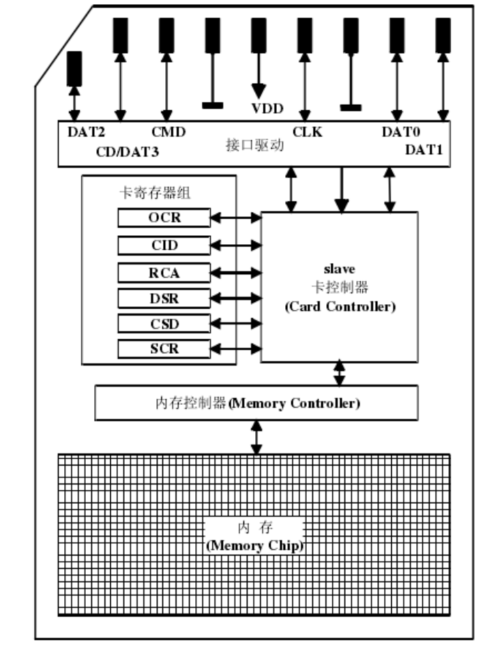

> 物联网安全是离不开硬件领域的。而计算机科学与技术专业出身的我，嵌入式知识实属匮乏。公司组内有大量免费玩具却不会玩，这口气实在难以下咽。接下来是对自己嵌入式硬件知识的早教记录。

# PCB

[https://en.wikipedia.org/wiki/Printed_circuit_board](https://en.wikipedia.org/wiki/Printed_circuit_board)

# 处理器

## MCU

- [https://en.wikipedia.org/wiki/Microcontroller](https://en.wikipedia.org/wiki/Microcontroller)

## STM32

- [https://en.wikipedia.org/wiki/STM32](https://en.wikipedia.org/wiki/STM32)

# IICEEPROM

IICEEPROM，采用的是IIC通信协议。

IIC通信协议具有的特点：简单的两条总线线路，一条串行数据线（SDA），一条串行时钟线（SCL）；串行半双工通信模式的8位双向数据传输，位速率标准模式下可达100Kbit/s；一种电可擦除可编程只读存储器，掉电后数据不丢失，由于芯片能够支持单字节擦写，且支持擦除的次数非常之多，一个地址位可重复擦写的理论值为100万次，常用芯片型号有AT24C02、FM24C02、CAT24C02等，其常见的封装多为DIP8，SOP8，TSSOP8等。

# Flash

- [https://en.wikipedia.org/wiki/Flash_memory](https://en.wikipedia.org/wiki/Flash_memory)
- [https://nieyong.github.io/wiki_ny/Flash.html](https://nieyong.github.io/wiki_ny/Flash.html)

在嵌入式设备中，由于其存储的简便性和小空间、高利用率、高稳定性等需求，要求一种特殊的存储介质来存储嵌入式固件。在过去的嵌入式设备中，EPROM和EEPROM是存储介质的主流产品，而目前flash存储介质已经占据了嵌入式存储市场的主流。按照其内部架构和实现技术主要分AND、NAND、NOR、DiNOR四种，其中NOR和NAND为flash的主流产品。

固件存储介质具有自身的数据存储、访问机制，用户对数据的访问也需要一套机制。为了实现上层对数据访问的有效性和透明性，底层的存储机制和上层的访问机制之间就需要一个接口，这就是存储技术驱动程序（MTD）。驱动程序用来实现对存储单元的管理，实现由逻辑结构到物理结构操作的透明映射，同时也包括坏块处理、损耗平衡等。

## NOR Flash

NORflash基本操作的最小单位为块，大小为64K-256K字节，一般是128K字节。每个块首部有记录信息，其余部分又可划分为多个扇区，每个扇区的大小一般为512字节。NORflash由于具有片内执行功能（XIP），所以经常用在数据处理模块。由于价格比较昂贵，体积较大，所以存储量也相对较小，一般来说NOR的容量在1M字节到32M字节之间。

NORflash是一个类似于RAM的随机访问存储设备。其地址引脚可以映射到存储介质的整个区间，并随机访问其中的每一个字节。NORflash读写操作一般采用512字节的块。为了降低费用、克服一些物理方面的限制，flash存储设备被分为多个块。数据的写入是以块为单位的，在写入数据块之前必须对相应的块进行擦除。NORflash在块擦除之前必须把块中所有的存储位置0，每次擦除的容量以64-128KB的块为单位，导致数据写入过程中耗时较长，块擦除的时间大约为5s。NORflash具有片内执行功能（XIP），而且还具有较高的读速度。但是它的存储空间较小，而且写速度和擦除速度较慢。一般用来存储片内执行程序。

NORFlash有并行和串行两种，串行一般是SOP封装，使用SPI协议。并行只有极少数BGA封装，一般是TSOP封装，TSOP-56,TFBGA-56,LFBGA-64。

NORFlash支持随机访问，因此擦除单位是Byte。这里指的是并行信号引脚，NOR的信号线和SRAM基本上是一样的。如果飞线会特别麻烦。

## SPINorFlash

SPINorFlash，采用的是SPI通信协议。有4线（时钟，两个数据线，片选线）或者3线（时钟，两个数据线）通信接口，由于它有两个数据线能实现全双工通信，因此比IIC通信协议的IICEEPROM的读写速度上要快很多。SPINorFlash具有NOR技术FlashMemory的特点，即程序和数据可存放在同一芯片上，拥有独立的数据总线和地址总线，能快速随机读取，允许系统直接从Flash中读取代码执行；可以单字节或单字编程，但不能单字节擦除，必须以Sector为单位或对整片执行擦除操作，在对存储器进行重新编程之前需要对Sector或整片进行预编程和擦除操作。

NorFlash在擦写次数上远远达不到IICEEPROM，并且由于NOR技术FlashMemory的擦除和编程速度较慢，块尺寸又较大，因此擦除和编程操作所花费的时间会很长；但SPINorFlash接口简单，使用的引脚少，易于连接，操作方便，并且可以在芯片上直接运行代码，其稳定性出色，传输速率高，在小容量时具有很高的性价比，这使其很适合应于嵌入式系统中作为FLASHROM，所以在市场的占用率非常高。

常见到的S25FL128、MX25L1605、W25Q64等型号都是SPINorFlash，其常见的封装多为SOP8，SOP16，WSON8，US0N8，QFN8、BGA24等

## ParallelNorFalsh（CFIFlash）

ParallelNorFalsh，也叫做并行NorFlash，采用的Parallel接口通信协议。拥有独立的数据线和地址总线，它同样继承了NOR技术FlashMemory的所有特点；由于采用了Parallel接口，ParallelNorFalsh相对于SPINorFlash，支持的容量更大，读写的速度更快，但是由于占用的地址线和数据线太多，在电路电子设计上会占用很多资源。ParallelNorFalsh读写时序类似于SRAM，只是写的次数较少，速度也慢，由于其读时序类似于SRAM，读地址也是线性结构，所以多用于不需要经常更改程序代码的数据存储。

常见到的S29GL128、MX29GL512、SST39VF020等型号都是ParallelNorFlash，其常见的封装多为TSSOP32、TSOP48、BGA64，PLCC32等。

## NAND Flash

NANDFlash属于非易失性存储器，对于嵌入式设备，一般使用SLC，单位是1-bit，是一种浮栅结构，可以捕获电子并且外部绝缘，断电之后可以保留数据。Flash都不支持覆盖，即写入操作只能在空或已擦除的单元内进行。擦除方法是在源极加正电压利用第一级浮空栅与漏极之间的隧道效应，将注入到浮空栅的负电荷吸引到源极。由于利用源极加正电压擦除，因此各单元的源极联在一起，这样，擦除不能按字节擦除，而是全片或者分块擦除。

NANDflash一般来说分为多个区，区是在逻辑层面的概念，不涉及物理层。一个区是由多个块组成的，一般为256-1024个。块是由多个页组成的，页的大小通常是512字节的倍数，一般为512字节。每一页又分为两部分，一部分是主数据区，另一部分是冗余区。主数据区内存储数据部分，冗余区内存储校验信息，用于检测是否出现坏块。

NANDflash富有效率的架构设计使得相同容量下其单元器件的大小仅相当于NORflash的一半，生产工艺简单更是让NANDflash在相同大小的器件上提供更强大的密集度和存储容量。一般来说NANDflash的存储容量在16M字节和512M字节之间。

NANDflash是通过复杂的I/O接口进行通信，具体使用8个引脚传送地址、控制等信号，而且接口标准不统一，数据每次存取量一般512字节。NANDflash这种结构一般适用于对数据的存储。

NANDflash也是被分为多个块，数据的写入是以块为单位的，在写入数据块之前必须对相应的块进行擦除。每次擦除的容量是以8-32KB的块为单位，擦除时间大约为4ms。这就使得其读写速度较NORflash快很多NANDflash设计了一种高密度和大容量单元存储方式，而且擦除过程比较快，写速度比NOR要快的多。单纯的NAND存储设备主要用来进行数据存储，如果设备内部有片内执行代码则一般来说会存储在NOR中。

ONFI标准定义了一些常用的NAND封装，NANDFlash一般是TSOP和BGA的封装，都使用SMT的贴装方式。

## ParallelNandFlash

ParallelNandFlash同样采用了Parallel接口通信协议，NandFlash在工艺制程方面分有三种类型：SLC、MLC、TLC。

NandFlash技术FlashMemory具有以下特点：以页为单位进行读和编程操作，以块为单位进行擦除操作；具有快编程和快擦除的功能，其块擦除时间是2ms，而NOR技术的块擦除时间达到几百ms；芯片尺寸小，引脚少，是位成本（bitcost）最低的固态存储器;芯片包含有坏块，其数目取决于存储器密度。坏块不会影响有效块的性能，但设计者需要有一套的坏块管理策略。

对比ParallelNorFalsh，NandFlash在擦除、读写方面，速度快，使用擦写次数更多，并且它强调更高的性能，更低的成本，更小的体积，更大的容量，更长的使用寿命。这使NandFlash很擅于存储纯资料或数据等，在嵌入式系统中用来支持文件系统。其主要用来数据存储，大部分的U盘都是使用NandFlash，当前NandFlash在嵌入式产品中应用仍然极为广泛，因此坏块管理、掉电保护等措施就需要依赖NandFlash使用厂家通过软件进行完善。

常见到的S34ML01G100、MX30LF2G18AC、MT29F4G08ABADA等型号都是ParallelNandFlash，其常见的封装多为TSOP48、BGA63、BGA107，BGA137等。

## SPINandFlash

SPINandFlash，采用了SPINorFlash一样的SPI的通信协议，在读写的速度上没什么区别，但在存储结构上却采用了与ParallelNandFlash相同的结构，所以SPInand相对于SPInorFlash具有擦写的次数多，擦写速度快的优势，但是在使用以及使用过程中会同样跟ParallelNandFlash一样会出现坏块，因此，也需要做特殊坏块处理才能使用。

SPINandFlash相对比ParallelNandFlash还有一个重要的特点，那就是芯片自己有内部ECC纠错模块，用户无需再使用ECC算法计算纠错，用户可以在系统应用当中可以简化代码，简单操作。

常见到的W25N01GVZEIG、GD5F4GQ4UBYIG、F50L1G41A等型号都是SPINandFlash，其常见的封装多为QFN8、BGA24等。

### MMC

MultiMediaCard

[https://en.wikipedia.org/wiki/MultiMediaCard](https://en.wikipedia.org/wiki/MultiMediaCard)

#### eMMC

[https://en.wikipedia.org/wiki/MultiMediaCard#eMMC](https://en.wikipedia.org/wiki/MultiMediaCard#eMMC)

eMMC采用统一的MMC标准接口，自身集成MMCController，存储单元与NandFlash相同。针对Flash的特性，eMMC产品内部已经包含了Flash管理技术，包括错误探测和纠正，Flash平均擦写，坏块管理，掉电保护等技术。MMC接口速度高达每秒52MBytes，eMMC具有快速、可升级的性能，同时其接口电压可以是1.8v或者是3.3v。

eMMC相当于NandFlash+主控IC，对外的接口协议与SD、TF卡一样，主要是针对手机或平板电脑等产品的内嵌式存储器标准规格。eMMC的一个明显优势是在封装中集成了一个控制器，它提供标准接口并管理闪存，使得手机厂商就能专注于产品开发的其它部分，并缩短向市场推出产品的时间。这些特点对于希望通过缩小光刻尺寸和降低成本的NAND供应商来说，同样的重要。

eMMC由一个嵌入式存储解决方案组成，带有MMC（多媒体卡）接口、快闪存储器设备（NandFlash）及主控制器，所有都在一个小型的BGA封装，最常见的有BGA153封装;我们通常见到的KLMAG8DEDD、THGBMAG8B4JBAIM、EMMC04G-S100等型号都是eMMCFlash。eMMCFlash存储容量大，市场上32GByte容量都常见了，其常见的封装多为BGA153、BGA169、BGA100等。

### UFS

- [https://en.wikipedia.org/wiki/Universal_Flash_Storage](https://en.wikipedia.org/wiki/Universal_Flash_Storage)

# 芯片封装

- [https://www.sohu.com/a/158654863_609521](https://www.sohu.com/a/158654863_609521)
- [https://www.youtube.com/watch?v=2ua8PeP9ql4&t=153s](https://www.youtube.com/watch?v=2ua8PeP9ql4&t=153s)

- [https://zhuanlan.zhihu.com/p/509647754](https://zhuanlan.zhihu.com/p/509647754)
- [https://semiwiki.com/semiconductor-services/308968-semiconductor-packaging-history-primer/](https://semiwiki.com/semiconductor-services/308968-semiconductor-packaging-history-primer/)

# 协议

## UART

- [https://zh.wikipedia.org/zh-cn/UART](https://zh.wikipedia.org/zh-cn/UART)

### RS232

- [https://zh.wikipedia.org/zh-cn/RS-232](https://zh.wikipedia.org/zh-cn/RS-232)

## I2C

- [https://zh.wikipedia.org/wiki/I%C2%B2C](https://zh.wikipedia.org/wiki/I%C2%B2C)

## JTAG

- [https://en.wikipedia.org/wiki/JTAG](https://en.wikipedia.org/wiki/JTAG)
- [https://www.xjtag.com/zh-hans/about-jtag/what-is-jtag/](https://www.xjtag.com/zh-hans/about-jtag/what-is-jtag/)
- [https://iot-security.wiki/hardware-security/debug/jtag.html](https://iot-security.wiki/hardware-security/debug/jtag.html)

## SPI

# TF/SD

SD卡的内部结构如下图所示，可区分为slave卡控制器（Card Controller）、卡寄存器组、内存控制器（Memory Controller）和内存（Memory Chip）4部分。 

slave卡控制器主要完成以下功能∶

（1）接收卡HOST控制器发送的指令，并进行指令拆包，返回相应的响应；

（2）接收卡HOST控制器发送数据，并对数据进行拆包，返回相应的响应；

（3）接收内存控制器发送的数据，根据SD3.0协议，对数据进行打包，将其发送给卡HOST控制器。

（4）通知内存控制器接收由卡HOST控制器发送的、已经被拆包的数据。

卡寄存器组内存放卡支持的特性或者参数，可通过特定的指令进行读取。SD3.0协议定义了8个寄存器用来作为存储卡与SD卡HOST控制器交互的接口，包括4个描述卡片详细信息的寄存器（OCR、CID、SCR、CSD）、2个配置寄存器（RCA、DSR）、2个描述强制型的卡状态信息寄存器（SSR、CS）。通过专用命令可访问这些寄存器，获得卡支持的特性或者设置参数。

内存控制器完成对内存的读写。内存完成对数据的存储。 

TF卡采用SD卡架构，读写协议与SD卡一致，但只有一根地线，其它针脚与SD卡相同。TF卡和SD卡的针脚对应关系如下图所示。 

SD工作模式

SD卡有两种工作模式∶SD模式和SPI模式。其中SD模式允许4条数据线并行工作，主要应用于对数据传输速率要求较高的场合；而SPI模式仅能单数据线传输，传输速度较慢。在SD/TF卡上电之后，可通过发送特定的指令，将卡置于某种工作模式。

（1）SD模式

SD模式是一种异步串行通信接口模式。在SD工作模式下，CMD引脚为双向的命令/响应信号，从该CMD线上串行传输，命令可以以单机寻址（寻址命令）或呼叫所有卡（广播命令）方式发送；响应是对之前命令的回答，可以来自单机或所有卡；DATO～3为4个双向的数据信号。

SD模式的总线拓扑结构为如下图所示。所有卡使用公共的时钟CLK、电源Vss和地信号Vpp，独立的命令总线（CMD）和数据总线（DAT0~DAT3）。上电后，SD卡默认使用DATO，主机可以通过初始化来改变线宽。但是，各个SD卡不能共用命令、回复和数据（DATO～3）。

SPI模式

SPI（Serial Peripheral Interface，串行外设接口）模式是一种同步串行通信模式，使用4个信号线∶串行时钟线（SCK）、主机输入/从机输出线（DO）、主机输出/从机输入线（DI）和使能信号线（CS）。

SPI模式的总线允许通过2通道（数据输入和输出）传输数据，其拓扑结构如下图所示。当SPI总线上挂接N张卡时，需要N个CS片选信号。SPI模式相对于SD模式的不足之处是速度偏低。

SD卡启动时，默认采用SD模式。它将在CS信号有效（低电平）时接收一个复位命令（CMD0）来进入SPI模式。如果该卡认为必须停留在SD模式，那么它将不应答这个命令并继续保持在SD模式。如果可以转换到SPI模式，则会转换到SPI模式并用SPI模式的RI应答来回应，而让卡返回SD模式的唯一办法是重新加电。SPI模式下，默认的命令结构/协议CRC检查是失效的。由于卡在电源开启时总是处于SD模式，CMDO命令必须附带一个合法的CRC字节（即使这个命令使用了SPI结构来发送）。一旦进入SPI总线模式，CRC就被默认为失效。

# 工具

## 逻辑分析仪

- [https://en.wikipedia.org/wiki/Logic_analyzer](https://en.wikipedia.org/wiki/Logic_analyzer)
- [https://zhuanlan.zhihu.com/p/94386957](https://zhuanlan.zhihu.com/p/94386957)
- [https://www.anquanke.com/post/id/276280](https://www.anquanke.com/post/id/276280)

一款逻辑分析仪的样本：

- [http://www.qdkingst.com/cn](http://www.qdkingst.com/cn)
- [http://res.kingst.site/kfs/doc/Kingst%e9%87%91%e6%80%9d%e7%89%b9%e8%99%9a%e6%8b%9f%e4%bb%aa%e5%99%a8%e4%bd%bf%e7%94%a8%e6%89%8b%e5%86%8c.pdf](http://res.kingst.site/kfs/doc/Kingst%e9%87%91%e6%80%9d%e7%89%b9%e8%99%9a%e6%8b%9f%e4%bb%aa%e5%99%a8%e4%bd%bf%e7%94%a8%e6%89%8b%e5%86%8c.pdf)

# 姿势

## 固件提取

- [https://www.anquanke.com/post/id/227285](https://www.anquanke.com/post/id/227285)

## 硬件调试

- [https://www.riverloopsecurity.com/blog/2020/01/hw-101-uart/](https://www.riverloopsecurity.com/blog/2020/01/hw-101-uart/)
