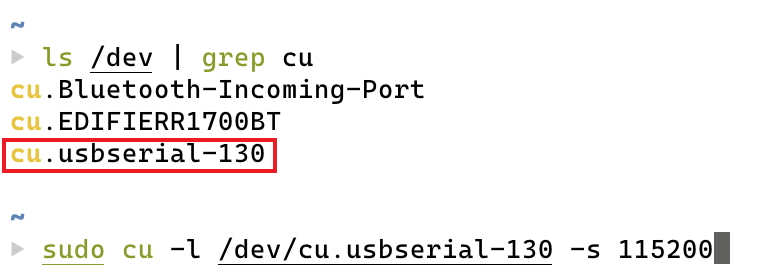
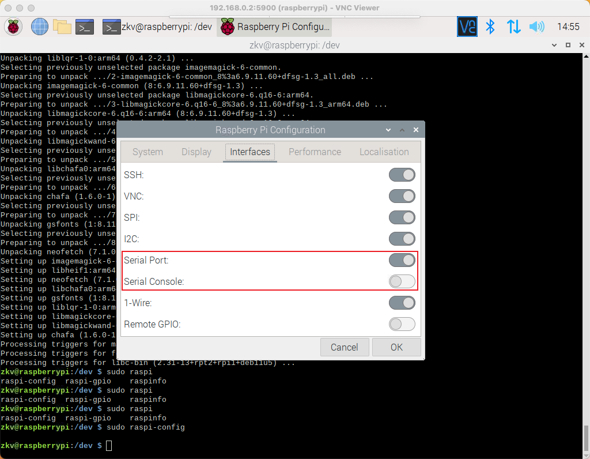
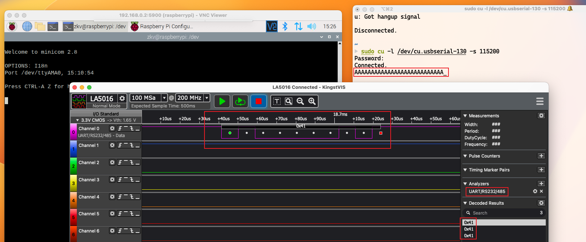
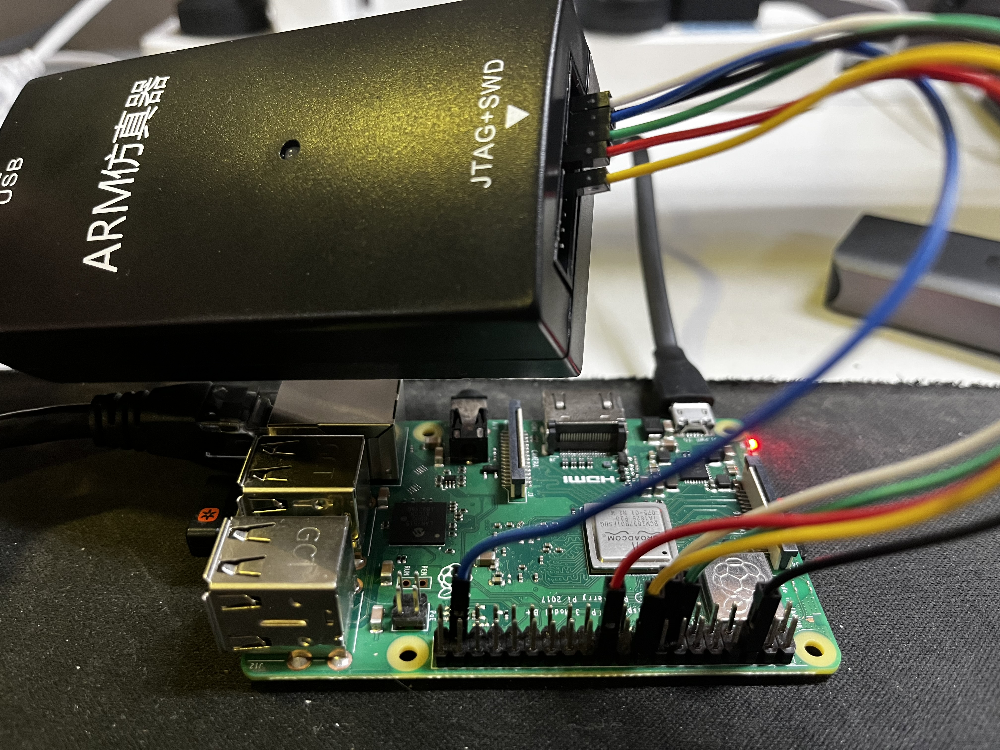

 

# 树莓派3B+的结构

以本次的样本**树莓派3B+**为例，先来认识认识它的PCB板：


我们重点会使用到的是其上的GPIO接口，其引脚如下：

> GPIO, General-purpose input/output, [https://en.wikipedia.org/wiki/General-purpose_input/output](https://en.wikipedia.org/wiki/General-purpose_input/output)


# UART连接与逻辑分析仪

## 从UART获取login shell

UART，Universal asynchronous receiver-transmitter：[https://en.wikipedia.org/wiki/Universal_asynchronous_receiver-transmitter](https://en.wikipedia.org/wiki/Universal_asynchronous_receiver-transmitter)

UART使用两条线进行双向异步数据传输，Tx->Rx; Rx->Tx：


树莓派3B+的UART口为GPIO的8号和10号引脚，在raspbian若启用，则于此默认提供login shell。想要链接它则你先需要一个USB转TTL模块：

> [UART、RS232、TTL关系浅析](https://zhuanlan.zhihu.com/p/25893717)


然后将模块TXD接树莓派RXD、模块RXD接树莓派TXD，模块GND接树莓派GND（地线），并将模块接入你的电脑：


此时若已在树莓派中启用UART串口与UART串口console，则可以电脑直接访问该得到树莓派login shell。MacOS下的命令为：



## 自UART进行裸串口通信

但若我们想要的不是login shell，而是一个raw的异步通信接口，可供我们编程，则需要做相应的操作。

树莓派的串口分为了主串口和辅助串口：

- 主串口：通过硬件引脚进行通信
- 辅助串口：默认被分配给蓝牙端，不能用于GPIO引脚通信

对应到树莓派的设备文件，则为：

- /dev/ttyS0：字符设备文件，mini UART，mini串口
- /dev/ttyAMA0：字符设备文件，first PL001 UART0，硬件串口
- /dev/serial0：符号链接文件，主串口
- /dev/serial1：符号链接文件，辅助串口

我们先对串口做如下设置：

```sh
sudo raspi-config
```

或使用GUI配置程序，将串口调整为：



树莓派重启后，此时执行`ls -l /dev`可以发现，serial0 -> ttyS0; serial1 -> ttyAMA0，主串口（serial0）指向了mini串口，辅助串口（serial1）指向了硬件串口（ttyAM0）。我们需要对其进行调换。

编辑`/boot/config.txt`，追加

```sh
dtoverlay=pi3-miniuart-bt
force_turbo=1
```

重启后可以看到，串口指向如我们所愿：


接下来在树莓派上安装minicom用于串口通信：

```sh
sudo apt install minicom
```

此后树莓派执行：

```sh
minicom -D /dev/ttyAMA0 -b 115200
```

Mac执行：

```sh
sudo cu -l /dev/cu.usbserial-130 -s 115200
```

此时于一端输入的数据会直接打印到另一端：


## 使用逻辑分析仪读取UART传输电平还原数据

请出逻辑分析仪**Kingst LA5016**，将其的两个通道连接至树莓派UART针脚，GND连接至树莓派GND针脚：

（这玩意还挺贵，不是我掏钱。逻辑分析仪价格从几十到几千都有)

我们于任意一端输入数据，则可在逻辑分析仪配套软件中捕获到电平信号，接使用UART解码器能解析出明文数据：



# 树莓派的 JTAG调试

首先在树莓派中开启GPIO JTAG，在`/boot/config.txt`末尾添加`enable_jtag_gpio=1`即可。

由于gdb未适配我手头的采用M2芯片的MacBook Air，故使用Debian11物理运行JTAG调试端。采用的工具是openocd：

由此下载：[https://github.com/xpack-dev-tools/openocd-xpack/releases](https://github.com/xpack-dev-tools/openocd-xpack/releases)

将JLINK与树莓派的JTAG引脚连接起来，加上GND，总共6根线：




将下载好的openocd工具解压，进入目录后，执行：

```sh
./bin/openocd -f ./scripts/interface/jlink.cfg -f ./scripts/board/rpi3.cfg
```

其中`./scripts/interface/jlink.cfg`对应的是我们使用的ARM仿真器JLINK V9的配置文件，`./scripts/board/rpi3.cfg`是树莓派3B的配置文件。也可以添加` -c "bindto 0.0.0.0"`将调试端口（默认127.0.0.1）开放在0.0.0.0以方便远程调试：

```sh
~/xpack-openocd-0.11.0-5                                                                      
▶ ./bin/openocd -f ./scripts/interface/jlink.cfg -f ./scripts/board/rpi3.cfg
xPack OpenOCD x86_64 Open On-Chip Debugger 0.11.0+dev (2022-09-01-17:56)
Licensed under GNU GPL v2
For bug reports, read
        http://openocd.org/doc/doxygen/bugs.html
Info : auto-selecting first available session transport "jtag". To override use 'transport select <trans
Warn : Transport "jtag" was already selected
trst_only separate trst_push_pull

Info : Listening on port 6666 for tcl connections
Info : Listening on port 4444 for telnet connections
Info : J-Link V9 compiled Dec 13 2019 11:14:50
Info : Hardware version: 9.70
Info : VTarget = 3.291 V
Info : clock speed 4000 kHz
Info : JTAG tap: bcm2837.cpu tap/device found: 0x4ba00477 (mfg: 0x23b (ARM Ltd), part: 0xba00, ver: 0x4)
Info : bcm2837.cpu0: hardware has 6 breakpoints, 4 watchpoints
Info : bcm2837.cpu1: hardware has 6 breakpoints, 4 watchpoints
Info : bcm2837.cpu2: hardware has 6 breakpoints, 4 watchpoints
Info : bcm2837.cpu3: hardware has 6 breakpoints, 4 watchpoints
Info : gdb port disabled
Info : starting gdb server for bcm2837.cpu0 on 3333
Info : Listening on port 3333 for gdb connections
Info : starting gdb server for bcm2837.cpu1 on 3334
Info : Listening on port 3334 for gdb connections
Info : starting gdb server for bcm2837.cpu2 on 3335
Info : Listening on port 3335 for gdb connections
Info : starting gdb server for bcm2837.cpu3 on 3336
Info : Listening on port 3336 for gdb connections
```

可以看到对于树莓派3B+的博通BCM2837四核心处理器，开启了3333～3336四个端口供调试。使用gdb-multiarch attach上去即可开始调试CPU：

```sh
gef➤  set architecture aarch64
The target architecture is set to "aarch64".
gef➤  set endian little
The target is set to little endian.
gef➤  target remote 127.0.0.1:3333    
[!] Using `target remote` with GEF does not work, use `gef-remote` instead. You've been warned.
Remote debugging using 127.0.0.1:3333
warning: No executable has been specified and target does not support
determining executable automatically.  Try using the "file" command.
0xffffffd85e1249e4 in ?? ()
[ Legend: Modified register | Code | Heap | Stack | String ]
───────────────────────────────────────────────────────────────────────────────────────── registers ────
[!] Command 'registers' failed to execute properly, reason: max() arg is an empty sequence
───────────────────────────────────────────────────────────────────────────────────────────── stack ────
[!] Unmapped address: '0xffffffd85e933d40'
───────────────────────────────────────────────────────────────────────────────────── code:generic: ────
   0xffffffd85e1249d8                  paciasp 
   0xffffffd85e1249dc                  dsb    sy
   0xffffffd85e1249e0                  wfi    
[!] Command 'context' failed to execute properly, reason: 
gef➤  i r
x0             0x43fb1de           0x43fb1de
x1             0xffffff803b1889a0  0xffffff803b1889a0
x2             0x0                 0x0
x3             0xffffffd85e93fac0  0xffffffd85e93fac0
x4             0x1                 0x1
x5             0xffffffa7dcb27000  0xffffffa7dcb27000
x6             0xffffffd85e933ce0  0xffffffd85e933ce0
x7             0xfffffffffffffffe  0xfffffffffffffffe
x8             0x0                 0x0
x9             0xffffffd85d70fe60  0xffffffd85d70fe60
x10            0x1a00              0x1a00
x11            0x0                 0x0
x12            0x0                 0x0
x13            0x0                 0x0
x14            0x0                 0x0
x15            0x7fbcd646a8        0x7fbcd646a8
x16            0x0                 0x0
x17            0x0                 0x0
x18            0x0                 0x0
x19            0x1                 0x1
x20            0xffffffd85e93892c  0xffffffd85e93892c
x21            0xffffffd85e938840  0xffffffd85e938840
x22            0xffffffd85e49b508  0xffffffd85e49b508
x23            0xffffffd85e65f938  0xffffffd85e65f938
x24            0xffffffd85e44dbb0  0xffffffd85e44dbb0
x25            0x0                 0x0
x26            0x0                 0x0
x27            0xffffff803b1e8280  0xffffff803b1e8280
x28            0xffffffd85e400438  0xffffffd85e400438
x29            0xffffffd85e933d40  0xffffffd85e933d40
x30            0xffffffd85e124a00  0xffffffd85e124a00
sp             0xffffffd85e933d40  0xffffffd85e933d40
pc             0xffffffd85e1249e4  0xffffffd85e1249e4
cpsr           0x400000c5          [ SP=1 EL=2 nRW=0 F I Z ]
fpsr           0x10                0x10
fpcr           0x0                 0x0
ELR_EL1        0xffffffd85e124a08  0xffffffd85e124a08
ESR_EL1        0x56000000          0x56000000
SPSR_EL1       0x40000005          0x40000005
ELR_EL2        0x0                 0x0
ESR_EL2        0x0                 0x0
SPSR_EL2       0x0                 0x0
ELR_EL3        0x0                 0x0
ESR_EL3        0x0                 0x0
SPSR_EL3       0x0                 0x0
gef➤  
```

